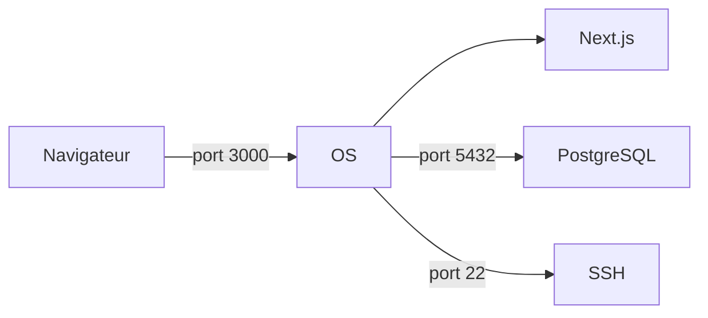

`Couche 1 — Transport & protocoles`

# Ports

> Comprendre comment l'OS dirige le trafic réseau vers le bon programme grâce aux numéros de ports.

**Prérequis :** aucun

**Ce que tu vas apprendre :**
- Ce qu'est un port et pourquoi chaque service a le sien
- Comment observer les ports ouverts sur ta machine
- Comment diagnostiquer un conflit de port (EADDRINUSE)

---

## 🟦 Carte d'identité

**Définition simple :**
> Imagine un immeuble (ton ordinateur). L'adresse de l'immeuble, c'est l'adresse IP. Les ports, ce sont les numéros d'appartements. Quand quelqu'un sonne au port 80, c'est le web qui répond. Au port 22, c'est SSH. Chaque service a son appartement attitré.

**Rôle technique :**
> Un port est un numéro (0 à 65535) qui permet à l'OS de savoir à quel programme envoyer un paquet réseau entrant. Sans ports, ton Mac ne saurait pas si un paquet entrant est pour ton navigateur, ton serveur local, ou ton client SSH.

**Schéma** :
📸 à ajouter dans docs/

**Ports essentiels à connaître :**
| Port | Protocole | Usage |
|------|-----------|-------|
| 20/21 | FTP | Transfert de fichiers |
| 22 | SSH | Connexion distante sécurisée |
| 53 | DNS | Résolution de noms de domaine |
| 80 | HTTP | Web non chiffré |
| 443 | HTTPS | Web chiffré |
| 3000 | custom | Serveur local dev (Next.js, etc.) |
| 5432 | PostgreSQL | Base de données |
| 54321 | Supabase | Studio local |

---

## 🟩 Sous le capot

**Mécanisme :**
> Quand ton navigateur tape `http://localhost:3000`, voici ce qui se passe :
> 1. Le navigateur crée un paquet réseau destiné à `127.0.0.1:3000`
> 2. L'OS reçoit ce paquet et regarde le numéro de port : 3000
> 3. Il cherche dans sa table quel programme "écoute" sur ce port
> 4. Il transmet le paquet à ce programme (ton serveur Next.js)
> 5. Le serveur répond, l'OS renvoie la réponse au navigateur

**Outils d'observation sur Mac :**
```bash
# Voir tous les ports ouverts sur ta machine
lsof -i -P -n | grep LISTEN

# Voir quel programme utilise le port 3000
lsof -i :3000

# Scanner les ports d'une machine (ici ton Pi)
# (installer nmap d'abord : brew install nmap)
nmap -p 1-1000 [IP_DU_PI]
```

**Schéma technique** :


---

## 🟥 Laboratoire de test

**POC 1 — Voir les ports ouverts sur ton Mac :**
```bash
lsof -i -P -n | grep LISTEN
```
> Tu vas voir une liste de programmes avec leur port. Repère les ports 53 (DNS local), 5432 (si PostgreSQL tourne), etc.

**POC 2 — Conflit de ports (erreur classique) :**
```bash
# Lance deux fois un serveur sur le même port pour provoquer l'erreur
node -e "require('http').createServer().listen(3000, () => console.log('Serveur 1 OK'))"
node -e "require('http').createServer().listen(3000)" 
# → Error: EADDRINUSE — le port est déjà occupé
```

**Test de panne :**
> Lance ton serveur Next.js (`npm run dev`), puis dans un autre terminal tue le processus sur le port 3000 :
```bash
lsof -ti:3000 | xargs kill
```
> Résultat : ton navigateur affiche "Connection refused". Le port existe mais personne n'écoute.

**Commande clé à retenir :**
```bash
lsof -i -P -n | grep LISTEN
```

---

## 💀 Zone de hack

**Vulnérabilité classique — Port scanning :**
> Un attaquant commence toujours par scanner les ports ouverts de sa cible. Chaque port ouvert = une porte potentielle. Plus tu as de ports ouverts inutilement, plus tu es vulnérable.

**Simulation — Scanner ton propre Mac :**
```bash
# Installe nmap si pas encore fait
brew install nmap

# Scanne ta propre machine
nmap -p 1-65535 localhost

# Scanne ton Raspberry Pi (remplace l'IP)
nmap -p 1-1000 192.168.1.XX
```

**Contre-mesure :**
> - Ferme les ports inutiles (désactive les services que tu n'utilises pas)
> - Sur le Pi : active le firewall `ufw`
```bash
sudo apt install ufw
sudo ufw default deny incoming
sudo ufw allow 22    # SSH seulement
sudo ufw enable
```

---

## 🔄 Alternatives

| Outil | Gratuit | Open Source | Freemium | Premium | Limites |
|-------|---------|-------------|----------|---------|---------|
| lsof | ✅ | ✅ | — | — | macOS/Linux uniquement |
| nmap | ✅ | ✅ | — | — | Illégal sur machines tierces |
| netstat | ✅ | ✅ | — | — | Syntaxe différente macOS/Linux |
| ss | ✅ | ✅ | — | — | Linux uniquement (pas macOS) |

> **Recommandation EticLab :** `lsof` est intégré à macOS — c'est le plus simple pour débuter. `nmap` pour le scan avancé.

---

## ✅ Checklist de validation

- [ ] Est-ce que je sais expliquer ce qu'est un port à quelqu'un ?
- [ ] Est-ce que je sais lister les ports ouverts sur ma machine ?
- [ ] Est-ce que je sais diagnostiquer un EADDRINUSE ?
- [ ] Est-ce que je connais les ports standards (22, 80, 443, 3000) ?

---

## 🧰 Toolbox

| Outil | Usage | Prix | Risque |
|-------|-------|------|--------|
| `lsof` | Voir ports ouverts (Mac/Linux) | Gratuit, intégré | Aucun |
| `nmap` | Scanner les ports d'une machine | Gratuit | Illégal sur machines tierces |
| `ufw` | Firewall simple (Linux/Pi) | Gratuit, intégré | Mal configuré = lockout SSH |
| Activity Monitor | Voir connexions réseau (Mac GUI) | Gratuit, intégré | Aucun |

---

## 📚 Aller plus loin

- [Liste des ports standards (IANA)](https://www.iana.org/assignments/service-names-port-numbers)
- [nmap — documentation officielle](https://nmap.org/docs.html)
