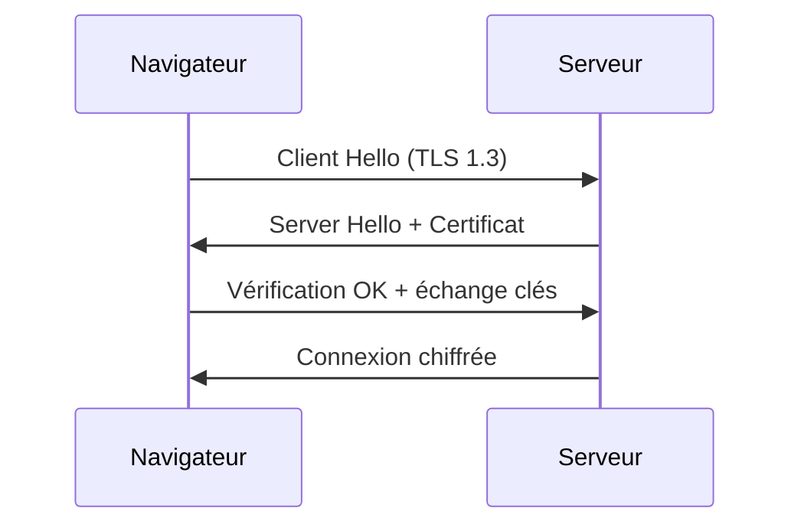

`Couche 1 — Transport & protocoles`

# SSL / TLS / HTTPS

> Comprendre le chiffrement des communications web : certificats, handshake TLS, et pourquoi HTTPS est obligatoire.

**Prérequis :** `C1-01` `C1-02` `C1-03`

**Ce que tu vas apprendre :**
- Ce qu'est un certificat SSL et comment il fonctionne
- Le handshake TLS en 5 étapes
- Comment inspecter un certificat avec openssl et Chrome

---

## 🟦 Carte d'identité

**Définition simple :**
> Imagine que tu envoies une lettre. En HTTP, la lettre est 
> ouverte — le facteur, tes voisins, n'importe qui peut la lire. 
> En HTTPS, la lettre est dans une enveloppe scellée — seul le 
> destinataire peut l'ouvrir. Le certificat SSL, c'est le sceau 
> qui prouve que l'enveloppe n'a pas été ouverte en chemin, 
> et que le destinataire est bien celui qu'il prétend être.

**Rôle technique :**
> SSL (Secure Sockets Layer) / TLS (Transport Layer Security) 
> est un protocole de chiffrement qui protège les données en 
> transit entre le navigateur et le serveur. HTTPS = HTTP + TLS. 
> Un certificat SSL est un fichier qui prouve l'identité du 
> serveur et permet d'établir une connexion chiffrée.

**Schéma** :
📸 à ajouter dans docs/

**Vocabulaire à ne pas confondre :**
| Terme | Signification |
|-------|---------------|
| SSL | Ancien nom du protocole (obsolète, remplacé par TLS) |
| TLS | Version moderne du protocole (TLS 1.3 = le standard actuel) |
| HTTPS | HTTP + TLS = communication web chiffrée |
| Certificat SSL | Fichier qui prouve l'identité du serveur |
| CA (Certificate Authority) | Organisme qui délivre les certificats |
| Let's Encrypt | CA gratuite et automatique |

**Ce qu'on dit "SSL" mais qu'on devrait dire "TLS" :**
> Tout le monde dit "certificat SSL" par habitude, mais en réalité 
> SSL est mort depuis 2015. On utilise TLS 1.2 ou 1.3. 
> C'est comme dire "Frigidaire" pour un réfrigérateur.

---

## 🟩 Sous le capot

**Mécanisme — Le "handshake" TLS :**
> Quand tu ouvres https://google.com, voici ce qui se passe 
> AVANT que la moindre page ne s'affiche :
> 1. **Client Hello** — Ton navigateur dit : "Bonjour, je parle 
>    TLS 1.3, voici les méthodes de chiffrement que je connais"
> 2. **Server Hello** — Le serveur répond : "OK, utilisons 
>    cette méthode, voici mon certificat SSL"
> 3. **Vérification** — Ton navigateur vérifie le certificat :
>    - Est-il signé par une CA de confiance ?
>    - Est-il encore valide (pas expiré) ?
>    - Le nom de domaine correspond-il ?
> 4. **Échange de clés** — Navigateur et serveur créent une 
>    clé de session unique (chiffrement symétrique)
> 5. **Connexion chiffrée** — Toutes les données sont maintenant 
>    chiffrées. La page peut s'afficher.

**Outils d'observation :**
```bash
# Voir le certificat complet d'un site
openssl s_client -connect google.com:443 -servername google.com </dev/null 2>/dev/null | openssl x509 -text -noout

# Version courte — juste les dates de validité
openssl s_client -connect google.com:443 -servername google.com </dev/null 2>/dev/null | openssl x509 -dates -noout

# Voir la chaîne de certificats
openssl s_client -connect google.com:443 -showcerts </dev/null 2>/dev/null

# Vérifier la version TLS utilisée
curl -vI https://google.com 2>&1 | grep "SSL connection"
```

**Schéma technique** :


**Dans Chrome DevTools :**
> 1. Clique sur le cadenas dans la barre d'adresse
> 2. "La connexion est sécurisée" → Certificat
> 3. Tu vois : émetteur (CA), validité, domaine couvert

---

## 🟥 Laboratoire de test

**POC 1 — Comparer HTTP vs HTTPS :**
```bash
# Ton serveur local (HTTP — pas de certificat)
curl -v http://localhost:3001 2>&1 | head -20

# Un vrai site en HTTPS
curl -v https://vercel.com 2>&1 | head -30
```

**POC 2 — Inspecter un certificat :**
```bash
echo | openssl s_client -connect vercel.com:443 -servername vercel.com 2>/dev/null | openssl x509 -dates -subject -issuer -noout
```

**POC 3 — Voir ce qui se passe avec un certificat expiré :**
```bash
curl https://expired.badssl.com
# → Erreur SSL certificate problem

# Forcer la connexion malgré le certificat invalide (dangereux)
curl -k https://expired.badssl.com
```

**Test de panne :**
> Si le certificat SSL expire :
> - Chrome affiche "Votre connexion n'est pas privée"
> - Sur Vercel : impossible — le renouvellement est automatique
> - Sur un serveur perso : il faut renouveler manuellement

**Commande clé à retenir :**
```bash
openssl s_client -connect domaine.com:443 -servername domaine.com </dev/null 2>/dev/null | openssl x509 -dates -noout
```

---

## 💀 Zone de hack

**Vulnérabilité classique — Man in the Middle (MITM) :**
> Sans HTTPS, un attaquant sur le même réseau WiFi peut 
> intercepter toutes les données entre toi et le serveur : 
> mots de passe, cookies, données personnelles.

**Autre risque — certificat auto-signé :**
> N'importe qui peut créer un certificat SSL. Mais s'il 
> n'est pas signé par une CA de confiance, le navigateur 
> affiche un avertissement.

**Vérification :**
```bash
curl -vI https://ton-site.vercel.app 2>&1 | grep "SSL connection"
# Devrait afficher TLS 1.3

openssl s_client -connect ton-site.vercel.app:443 -tls1 </dev/null 2>&1 | grep "error"
# → Devrait échouer (TLS 1.0 refusé = c'est bien)
```

**Contre-mesure :**
> - Toujours HTTPS en production
> - Utiliser Let's Encrypt (gratuit) ou le SSL auto de Vercel
> - Ne jamais ignorer les avertissements de certificat
> - Activer HSTS (force le navigateur à toujours utiliser HTTPS)

---

## 🔄 Alternatives

| Outil | Gratuit | Open Source | Freemium | Premium | Limites |
|-------|---------|-------------|----------|---------|---------|
| Let's Encrypt + certbot | ✅ | ✅ | — | — | Renouvellement tous les 90 jours |
| Vercel SSL | — | — | ✅ | — | Uniquement sur Vercel |
| Cloudflare SSL | ✅ | — | ✅ | — | Trafic passe par Cloudflare |
| AWS Certificate Manager | ✅ | — | — | ✅ | Uniquement sur AWS |
| DigiCert / Sectigo | — | — | — | ✅ (50-500$/an) | Cher, pas nécessaire |

> **Recommandation EticLab :** Sur Vercel, le SSL est automatique. 
> Sur le Raspberry Pi, utiliser Let's Encrypt avec certbot. 
> Ne jamais payer pour un certificat SSL basique.

---

## ✅ Checklist de validation

- [ ] Est-ce que je sais expliquer la différence entre HTTP et HTTPS ?
- [ ] Est-ce que je sais décrire le handshake TLS en grandes lignes ?
- [ ] Est-ce que je sais inspecter un certificat avec openssl ?
- [ ] Est-ce que je sais pourquoi Let's Encrypt suffit ?

---

## 🧰 Toolbox

| Outil | Usage | Prix | Risque |
|-------|-------|------|--------|
| openssl | Inspecter les certificats | Gratuit, intégré | Complexe |
| curl -v | Voir le handshake TLS | Gratuit, intégré | Aucun |
| Chrome DevTools | Voir le certificat dans le navigateur | Gratuit | Aucun |
| badssl.com | Tester avec des certificats invalides | Gratuit | Aucun |
| certbot | Obtenir un certificat Let's Encrypt | Gratuit, open source | Config serveur |

---

## 📚 Aller plus loin

- [Let's Encrypt — documentation](https://letsencrypt.org/docs/)
- [badssl.com — tester les certificats](https://badssl.com)

## Liens avec d'autres modules
- → C1-01-ports : HTTPS utilise le port 443
- → C1-02-http : HTTPS = HTTP + chiffrement TLS
- → C1-03-cdn : le CDN gère souvent le certificat SSL
- → C5-01-vercel : Vercel fournit SSL automatiquement
