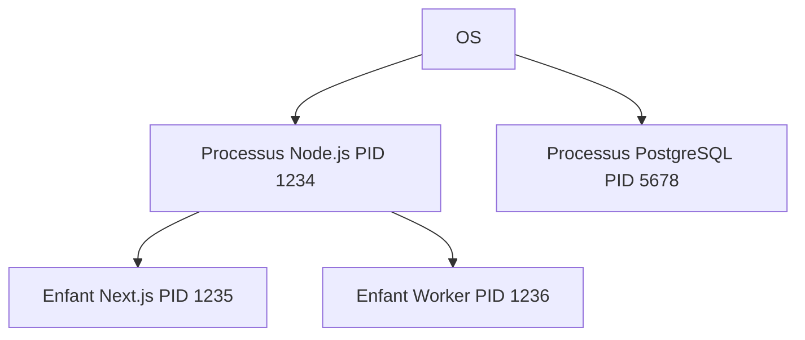

`Couche 2 — Environnement & conteneurs`

# OS & processus

> Comprendre comment le système d'exploitation gère les programmes, la mémoire et les processus.

**Prérequis :** `T-02`

**Ce que tu vas apprendre :**
- Ce qu'est un OS et comment il orchestre les programmes
- Comment observer les processus et les tuer correctement
- Pourquoi ne jamais faire tourner un serveur en root

---

## 🟦 Carte d'identité

**Définition simple :**
> L'OS (Operating System) c'est le chef d'orchestre. 
> Il gère qui a le droit d'utiliser le CPU, la mémoire, 
> le disque et le réseau. Sans lui, tes programmes ne 
> pourraient pas coexister — ils se marcheraient dessus.

**Rôle technique :**
> L'OS alloue les ressources matérielles aux processus, 
> gère les utilisateurs et permissions, et fournit les 
> interfaces (terminal, réseau, fichiers) que les programmes utilisent.

**Schéma** :
📸 à ajouter dans docs/

**Les 3 OS principaux :**
| OS | Usage | Noyau |
|----|-------|-------|
| macOS | Développement, créatifs | XNU (Unix) |
| Linux | Serveurs, Raspberry Pi | Linux |
| Windows | Grand public, entreprises | NT |

> Ton Mac et ton Raspberry Pi parlent des langages proches 
> (Unix/Linux) — c'est pour ça que les commandes Terminal 
> fonctionnent sur les deux.

---

## 🟩 Sous le capot

**Mécanisme :**
> 1. Tu lances un programme (ex: `node server.js`)
> 2. L'OS crée un processus avec un PID (identifiant unique)
> 3. L'OS lui alloue de la mémoire et du temps CPU
> 4. Le processus peut créer des processus enfants
> 5. Quand le processus termine, l'OS libère les ressources

**Outils d'observation :**
```bash
# Charge CPU et mémoire en temps réel
top

# Version plus lisible (si installé)
htop

# Infos système
uname -a         # Nom et version de l'OS
sw_vers          # Version macOS spécifiquement
df -h            # Espace disque
free -h          # Mémoire (Linux/Pi)
```

**Les processus :**
```bash
# Lister tous les processus
ps aux

# Voir l'arbre des processus (parent → enfants)
pstree           # Linux/Pi
ps aux --forest  # Alternative

# C'est pourquoi Benny n'était pas facile à tuer :
# Next.js crée un processus parent et des enfants.
# Tuer l'enfant ne tue pas le parent qui recrée l'enfant.
```

**Schéma technique** :


---

## 🟥 Laboratoire de test

**POC — Photographier ton système :**
```bash
uname -a
sw_vers
df -h
ps aux | grep node
lsof -i -P -n | grep LISTEN
```

**POC — Tuer Benny correctement :**
```bash
# Trouver le PID du processus Next.js
ps aux | grep next

# Tuer par nom de processus
pkill -f "next dev"

# Vérifier
lsof -i :3000
```

**Commande clé à retenir :**
```bash
ps aux | grep node
```

---

## 💀 Zone de hack

**Vulnérabilité classique — escalade de privilèges :**
> Sur Linux/Pi, chaque processus a un utilisateur. 
> Un attaquant qui accède à un processus cherche 
> à obtenir les droits "root" (administrateur). 
> C'est pour ça qu'on ne fait jamais tourner un 
> serveur web en root.

**Vérification :**
```bash
# Voir sous quel utilisateur tournent tes serveurs
ps aux | grep node
# La colonne 1 = l'utilisateur
# Si c'est "root" : danger
```

**Contre-mesure :**
> Toujours faire tourner les serveurs avec un 
> utilisateur limité, jamais root.

---

## 🔄 Alternatives

| Outil | Gratuit | Open Source | Freemium | Premium | Limites |
|-------|---------|-------------|----------|---------|---------|
| macOS | — | — | — | ✅ (avec Mac) | Lié au hardware Apple |
| Ubuntu (Linux) | ✅ | ✅ | — | — | Pas de GUI par défaut sur serveur |
| Raspberry Pi OS | ✅ | ✅ | — | — | ARM uniquement |
| Windows | — | — | — | ✅ | Commandes différentes |

> **Recommandation EticLab :** macOS pour le dev, Raspberry Pi OS 
> pour le serveur. Les deux sont Unix-like, les commandes sont proches.

---

## ✅ Checklist de validation

- [ ] Est-ce que je sais expliquer le rôle de l'OS ?
- [ ] Est-ce que je sais lister et tuer des processus ?
- [ ] Est-ce que je sais pourquoi pkill -f "next dev" est mieux que kill PID ?
- [ ] Est-ce que je sais pourquoi ne pas tourner en root ?

---

## 🧰 Toolbox

| Outil | Usage | Prix | Risque |
|-------|-------|------|--------|
| Activity Monitor | GUI processus macOS | Gratuit, intégré | Aucun |
| top / htop | Processus en temps réel | Gratuit | Aucun |
| Console.app | Logs système macOS | Gratuit, intégré | Aucun |
| ufw | Firewall Linux/Pi | Gratuit | Mauvaise config |

---

## 📚 Aller plus loin

- [Linux Journey — processus](https://linuxjourney.com/lesson/monitor-processes-ps-command)
- [Apple — Activity Monitor](https://support.apple.com/guide/activity-monitor)

## Liens avec d'autres modules
- → T-02-terminal : on observe l'OS via le terminal
- → C1-01-ports : l'OS gère l'attribution des ports
- → C2-03-docker : Docker isole des processus OS
