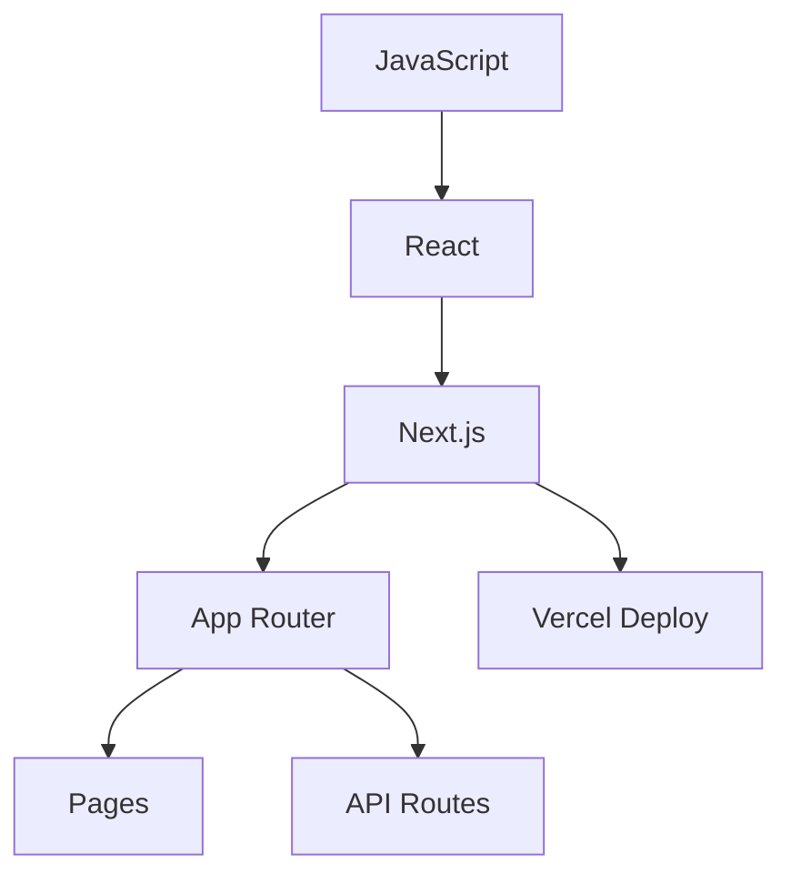

`Couche 3 — Backend & données`

# Next.js & React

> Comprendre la structure d'une application web moderne : composants, pages, routing, et pourquoi Next.js est construit au-dessus de React.

**Prérequis :** `T-01` `T-01b` `C1-01` `C1-02`

**Ce que tu vas apprendre :**
- La différence entre React (librairie) et Next.js (framework)
- Comment créer des composants et des pages
- Server Components vs Client Components

---

## 🟦 Carte d'identité

**Définition simple :**
> React, c'est une boîte de Lego : chaque brique est un 
> "composant" (un bouton, un menu, une carte). Tu assembles 
> les briques pour construire une page. Mais React seul ne 
> sait pas gérer les URLs, le serveur, ou le déploiement.
> Next.js, c'est le plan de construction livré avec la boîte : 
> il organise les briques, gère les pages, et fait tourner 
> le tout sur un serveur.

**Rôle technique :**
> React est une librairie JavaScript pour construire des 
> interfaces utilisateur à base de composants réutilisables.
> Next.js est un framework construit au-dessus de React qui 
> ajoute tout ce qu'il manque pour faire un vrai site :
> routing, rendu serveur (SSR), API routes, et optimisations.

**Schéma** :
📸 à ajouter dans docs/

**React seul vs Next.js :**
| Fonctionnalité | React seul | Next.js |
|----------------|------------|---------|
| Composants | ✅ | ✅ (c'est du React) |
| Routing (pages/URLs) | ❌ (il faut react-router) | ✅ (basé sur les fichiers) |
| Rendu serveur (SSR) | ❌ (complexe à configurer) | ✅ (natif) |
| API backend | ❌ (il faut Express ou autre) | ✅ (API routes intégrées) |
| Optimisation images | ❌ | ✅ (next/image) |
| Déploiement | Manuel | Vercel en 1 clic |

**Ce que Next.js n'est PAS :**
- Ce n'est pas un langage (le langage c'est JavaScript/TypeScript)
- Ce n'est pas un CMS (il ne gère pas le contenu)
- Ce n'est pas obligatoire pour utiliser React (mais c'est recommandé)

**Schéma mental :**
```
JavaScript (le langage)
    └── React (la librairie de composants)
            └── Next.js (le framework complet)
                    └── Vercel (la plateforme de déploiement)
```

---

## 🟩 Sous le capot

**Mécanisme :**
> 1. Tu crées un projet avec `npx create-next-app@latest`
> 2. Tu crées des fichiers `page.tsx` dans le dossier `app/`
> 3. Chaque fichier `page.tsx` devient automatiquement une route
> 4. Tu lances `npm run dev` — le serveur démarre sur le port 3000
> 5. Next.js compile, optimise et sert les pages

**Structure d'un projet Next.js (App Router) :**
```
mon-projet/
├── package.json         ← scripts et dépendances
├── next.config.js       ← configuration Next.js
├── app/                 ← le dossier principal (App Router)
│   ├── layout.tsx       ← mise en page globale (header, footer)
│   ├── page.tsx         ← page d'accueil (route /)
│   ├── about/
│   │   └── page.tsx     ← page /about
│   └── api/
│       └── hello/
│           └── route.ts ← endpoint API /api/hello
├── public/              ← fichiers statiques (images, favicon)
└── node_modules/        ← dépendances (ne pas toucher)
```

**Outils d'observation :**
```bash
npm run dev     # Serveur de développement (hot reload)
npm run build   # Construire pour la production
npm run start   # Lancer la version production
npm run lint    # Vérifier la qualité du code
```

**Schéma technique** :


**Comprendre les composants React :**
```jsx
function Bouton({ texte }) {
  return <button>{texte}</button>;
}

<Bouton texte="Cliquez ici" />
```

**Server Components vs Client Components :**
```
Server Component (par défaut)
  → S'exécute sur le serveur, pas de JS envoyé au navigateur
  → Pas d'interactivité (pas de onClick, useState)

Client Component (ajouter "use client" en haut)
  → S'exécute dans le navigateur
  → Peut utiliser useState, useEffect, onClick
```

---

## 🟥 Laboratoire de test

**POC 1 — Créer et lancer un projet Next.js :**
```bash
cd ~/Dev/keticwork
npx create-next-app@latest test-nextjs
cd test-nextjs
npm run dev
```

**POC 2 — Créer une page :**
> Crée le fichier `app/labo/page.tsx` :
```tsx
export default function LaboPage() {
  return (
    <div style={{ padding: '2rem', fontFamily: 'sans-serif' }}>
      <h1>Ma page Labo</h1>
      <p>Cette page existe parce que le fichier existe.</p>
    </div>
  );
}
```

**POC 3 — Créer un composant réutilisable :**
> Crée `app/components/Carte.tsx` puis utilise-le dans une page.

**Test de compréhension :**
> Si tu crées `app/modules/C1-01/page.tsx`, 
> quelle URL sera accessible ?
> → http://localhost:3000/modules/C1-01

**Commande clé à retenir :**
```bash
npx create-next-app@latest mon-projet
```

---

## 💀 Zone de hack

**Vulnérabilité classique — exposer des secrets côté client :**
> Dans Next.js, seules les variables préfixées par `NEXT_PUBLIC_` 
> sont visibles côté navigateur. Si tu mets une clé API dans 
> `NEXT_PUBLIC_API_KEY`, tout le monde peut la lire.

**Vérification :**
```bash
grep -r "NEXT_PUBLIC_" .env*
npm run build
```

**Contre-mesure :**
> - Ne jamais mettre de secret dans une variable `NEXT_PUBLIC_`
> - Les clés API sensibles vont dans des variables sans préfixe
> - Toujours valider les entrées dans les Server Actions
> - Utiliser `.env.local` pour les secrets locaux

---

## 🔄 Alternatives

| Outil | Gratuit | Open Source | Freemium | Premium | Limites |
|-------|---------|-------------|----------|---------|---------|
| Next.js | ✅ | ✅ | — | — | Complexe pour un débutant |
| Remix | ✅ | ✅ | — | — | Moins de communauté |
| Astro | ✅ | ✅ | — | — | Moins adapté aux apps interactives |
| Vite + React | ✅ | ✅ | — | — | Pas de SSR natif |
| SvelteKit | ✅ | ✅ | — | — | Pas de React, écosystème plus petit |

> **Recommandation EticLab :** Next.js — c'est le choix de la stack 
> (Reflety et Benny l'utilisent). Comprendre React d'abord, 
> puis les couches que Next.js ajoute.

---

## ✅ Checklist de validation

- [ ] Est-ce que je sais la différence entre React et Next.js ?
- [ ] Est-ce que je sais créer une page avec un fichier page.tsx ?
- [ ] Est-ce que je sais la différence entre Server et Client Component ?
- [ ] Est-ce que je sais pourquoi NEXT_PUBLIC_ expose les variables ?

---

## 🧰 Toolbox

| Outil | Usage | Prix | Risque |
|-------|-------|------|--------|
| Next.js | Framework React complet | Gratuit, open source | Complexité initiale |
| React DevTools | Inspecter les composants | Gratuit (extension Chrome) | Aucun |
| create-next-app | Créer un projet Next.js | Gratuit | Aucun |
| Turbopack | Bundler rapide (inclus Next.js) | Gratuit | Encore jeune |
| ESLint | Vérifier la qualité du code | Gratuit, open source | Faux positifs |

---

## 📚 Aller plus loin

- [Next.js — documentation officielle](https://nextjs.org/docs)
- [React — documentation officielle](https://react.dev)

## Liens avec d'autres modules
- → T-01-nodejs : Next.js tourne sur Node.js
- → T-01b-package-json : les scripts dev/build/start sont dans package.json
- → C1-01-ports : le serveur de dev écoute sur le port 3000
- → C3-02-routing : le routing par fichiers est une feature clé
- → C5-01-vercel : Next.js se déploie nativement sur Vercel
