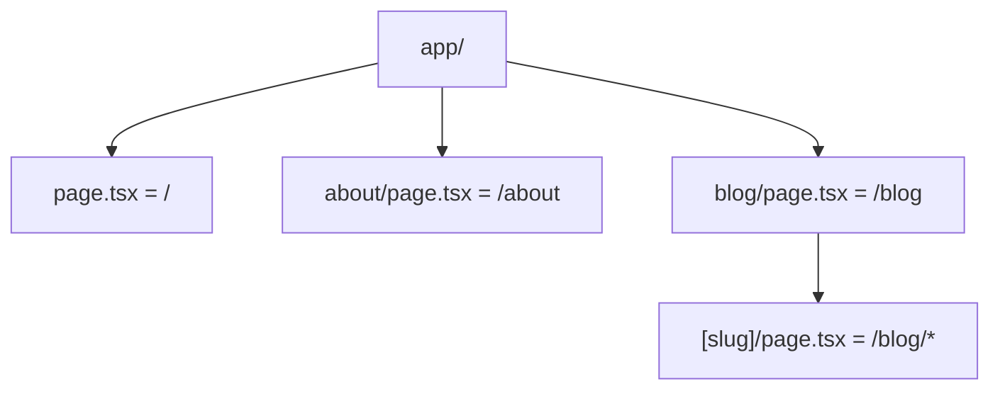

`Couche 3 — Backend & données`

# Routing (navigation)

> Comprendre comment la navigation fonctionne dans Next.js : pages, liens, routing dynamique, et comment l'URL correspond à un fichier.

**Prérequis :** `C3-01` `C1-02` `C1-01`

**Ce que tu vas apprendre :**
- Le routing par fichiers de Next.js (App Router)
- La différence entre routing statique et dynamique
- Les fichiers spéciaux (layout, loading, error, not-found)

---

## 🟦 Carte d'identité

**Définition simple :**
> Imagine un immeuble avec un plan d'étage à l'entrée. 
> Le routing, c'est ce plan : quand tu demandes "appartement 3B", 
> le plan te dit d'aller au 3e étage, porte B. 
> Dans un site web, quand tu tapes `/about`, le routing sait 
> quel fichier afficher. L'URL c'est l'adresse, le routing 
> c'est le facteur qui sait où livrer.

**Rôle technique :**
> Le routing est le mécanisme qui associe une URL à un contenu. 
> Dans Next.js (App Router), le routing est basé sur le système 
> de fichiers : la structure de tes dossiers dans `app/` définit 
> directement les URLs de ton site.

**Schéma** :
📸 à ajouter dans docs/

**Les deux types de routing :**
| Type | Comment ça marche | Exemple |
|------|-------------------|---------|
| Statique | Un fichier = une URL fixe | `app/about/page.tsx` → `/about` |
| Dynamique | Un fichier = un pattern d'URL | `app/blog/[slug]/page.tsx` → `/blog/mon-article` |

---

## 🟩 Sous le capot

**Mécanisme :**
> 1. Next.js scanne le dossier `app/` au démarrage
> 2. Chaque dossier contenant un `page.tsx` devient une route
> 3. Les dossiers avec `[param]` créent des routes dynamiques
> 4. Les `layout.tsx` enveloppent toutes les pages enfants
> 5. `<Link>` navigue sans recharger la page (client-side)

**Règles de nommage :**
```
app/
├── page.tsx              → /
├── about/
│   └── page.tsx          → /about
├── blog/
│   ├── page.tsx          → /blog
│   └── [slug]/
│       └── page.tsx      → /blog/mon-article
├── modules/
│   └── [couche]/
│       └── [id]/
│           └── page.tsx  → /modules/C1/01
└── api/
    └── hello/
        └── route.ts      → /api/hello (endpoint API)
```

**Outils d'observation :**
```bash
# Lister toutes les routes de ton projet
find app -name "page.tsx" -o -name "route.ts" | sort
```

**Schéma technique** :


**Fichiers spéciaux de Next.js :**
| Fichier | Rôle |
|---------|------|
| `page.tsx` | Le contenu de la page (obligatoire pour créer une route) |
| `layout.tsx` | Mise en page partagée (header, sidebar, footer) |
| `loading.tsx` | Écran de chargement pendant que la page se charge |
| `error.tsx` | Page d'erreur si quelque chose plante |
| `not-found.tsx` | Page 404 personnalisée |

**Navigation Next.js vs HTML classique :**
```
<a href="/about">       → recharge TOUTE la page (lent)
<Link href="/about">    → seul le contenu change (rapide)
```

**Les paramètres dynamiques :**
```tsx
// app/blog/[slug]/page.tsx
export default function BlogPost({ params }: { 
  params: { slug: string } 
}) {
  return <h1>Article : {params.slug}</h1>;
}
```

**Les groupes de routes (organisation sans URL) :**
```
app/
├── (marketing)/        ← parenthèses = pas dans l'URL
│   ├── about/page.tsx  → /about
│   └── pricing/page.tsx → /pricing
├── (app)/
│   ├── dashboard/page.tsx → /dashboard
│   └── settings/page.tsx  → /settings
```

---

## 🟥 Laboratoire de test

**POC 1 — Routing statique :**
> Crée `app/labo/page.tsx` avec un `<Link>` vers d'autres pages.

**POC 2 — Routing dynamique :**
> Crée `app/modules/[id]/page.tsx` et teste avec :
> - /modules/C1-01
> - /modules/C3-02
> - /modules/nimporte-quoi

**POC 3 — Layout partagé :**
> Crée `app/labo/layout.tsx` avec un header. 
> Toutes les pages dans `/labo/...` auront ce header.

**Test de panne :**
> Renomme `page.tsx` en `index.tsx` → la route disparaît. 
> Next.js ne reconnaît que `page.tsx`.

**Commande clé à retenir :**
```bash
find app -name "page.tsx" | sort
```

---

## 💀 Zone de hack

**Vulnérabilité classique — routes non protégées :**
> Par défaut, TOUTES les pages dans `app/` sont publiques. 
> Si tu crées `app/admin/page.tsx`, n'importe qui peut y 
> accéder via `/admin`.

**Autre risque — routes API sans validation :**
> Les fichiers `route.ts` dans `app/api/` sont des endpoints 
> publics. Sans validation des entrées, un attaquant peut 
> envoyer n'importe quelles données.

**Contre-mesure :**
> - Protéger les routes sensibles avec un middleware d'auth
> - Valider toutes les entrées dans les API routes
> - Utiliser les groupes de routes `(auth)/` pour organiser 
>   les pages protégées
> - Ne jamais mettre de données sensibles dans les paramètres d'URL

---

## 🔄 Alternatives

| Outil | Gratuit | Open Source | Freemium | Premium | Limites |
|-------|---------|-------------|----------|---------|---------|
| Next.js App Router | ✅ | ✅ | — | — | Conventions strictes |
| Next.js Pages Router | ✅ | ✅ | — | — | Ancien système |
| React Router | ✅ | ✅ | — | — | Config manuelle, pas de SSR |
| TanStack Router | ✅ | ✅ | — | — | Écosystème jeune |
| Remix (routes) | ✅ | ✅ | — | — | Approche web standard |

> **Recommandation EticLab :** App Router de Next.js — c'est le 
> standard actuel et celui utilisé dans Reflety et Benny.

---

## ✅ Checklist de validation

- [ ] Est-ce que je sais créer une route en créant un fichier page.tsx ?
- [ ] Est-ce que je sais la différence entre routing statique et dynamique ?
- [ ] Est-ce que je sais utiliser `<Link>` au lieu de `<a>` ?
- [ ] Est-ce que je sais que toutes les routes sont publiques par défaut ?

---

## 🧰 Toolbox

| Outil | Usage | Prix | Risque |
|-------|-------|------|--------|
| Next.js App Router | Routing par fichiers | Gratuit, intégré | Conventions strictes |
| next/link (Link) | Navigation sans rechargement | Gratuit, intégré | Aucun |
| next/navigation | useRouter, usePathname, useParams | Gratuit, intégré | Client-side uniquement |
| DevTools Network | Voir les requêtes de navigation | Gratuit | Aucun |

---

## 📚 Aller plus loin

- [Next.js — Routing documentation](https://nextjs.org/docs/app/building-your-application/routing)
- [Next.js — Dynamic Routes](https://nextjs.org/docs/app/building-your-application/routing/dynamic-routes)

## Liens avec d'autres modules
- → C3-01-nextjs : le routing est une feature centrale de Next.js
- → C3-03-composants : les pages utilisent des composants React
- → C1-02-http : chaque navigation = une requête HTTP
- → C5-01-auth : protéger certaines routes avec l'authentification
