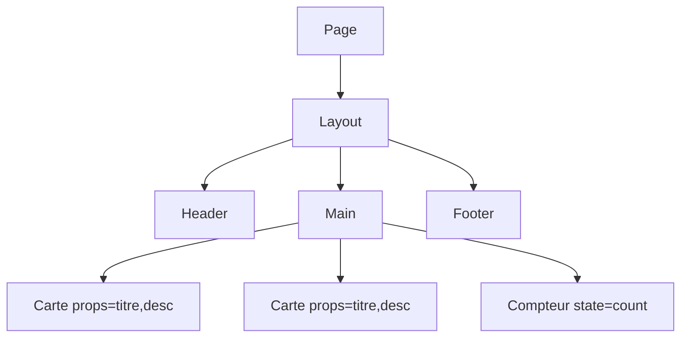

`Couche 3 — Backend & données`

# Composants & UI

> Comprendre comment construire une interface par blocs réutilisables avec React et les bases du design system.

**Prérequis :** `C3-01` `C3-02`

**Ce que tu vas apprendre :**
- Ce qu'est un composant React et comment le créer
- Comment passer des données avec les props et gérer l'état avec useState
- Ce qu'est un design system et pourquoi utiliser une librairie UI

---

## 🟦 Carte d'identité

**Définition simple :**
> Imagine des briques Lego. Chaque brique a une forme, une couleur, 
> et un rôle. Un bouton, c'est une brique. Une carte, c'est une 
> brique. Un menu, c'est une brique. Tu les assembles pour 
> construire une page, et tu peux réutiliser la même brique 
> partout — si tu changes la brique "bouton", elle change 
> partout automatiquement.

**Rôle technique :**
> Un composant React est une fonction JavaScript qui retourne du 
> JSX (un mélange de HTML et JavaScript). Les composants reçoivent 
> des données via les "props" (propriétés), gèrent leur état interne 
> avec "useState", et se combinent pour former des interfaces complexes. 
> Un design system est un ensemble de composants cohérents qui 
> garantissent une UI uniforme.

**Schéma** :
📸 à ajouter dans docs/

**Les 3 concepts clés :**
| Concept | Définition | Exemple |
|---------|-----------|---------|
| Composant | Fonction qui retourne du JSX | `function Bouton() { return <button>OK</button> }` |
| Props | Données passées au composant par le parent | `<Bouton texte="Valider" couleur="bleu" />` |
| State (état) | Données internes qui peuvent changer | `const [compteur, setCompteur] = useState(0)` |

---

## 🟩 Sous le capot

**Mécanisme :**
> 1. Tu crées un composant (une fonction qui retourne du JSX)
> 2. Tu passes des données via les props (comme des arguments)
> 3. Le composant s'affiche à l'écran (render)
> 4. Si l'utilisateur interagit (clic, saisie), le state change
> 5. React re-rend automatiquement le composant avec les nouvelles données

**Anatomie d'un composant :**
```tsx
// Composant simple — Server Component (par défaut)
export default function Carte({ titre, description }: {
  titre: string;
  description: string;
}) {
  return (
    <div className="carte">
      <h2>{titre}</h2>
      <p>{description}</p>
    </div>
  );
}

// Utilisation
<Carte titre="Ports" description="Module C1-01" />
```

**Composant avec état (Client Component) :**
```tsx
"use client";  // ← obligatoire pour utiliser useState

import { useState } from "react";

export default function Compteur() {
  const [count, setCount] = useState(0);

  return (
    <div>
      <p>Compteur : {count}</p>
      <button onClick={() => setCount(count + 1)}>+1</button>
      <button onClick={() => setCount(0)}>Reset</button>
    </div>
  );
}
```

**Outils d'observation :**
```bash
# Installer React DevTools dans Chrome
# → Extension "React Developer Tools"
# → Onglet "Components" dans DevTools
# → Tu vois l'arbre des composants, leurs props et state
```

**Schéma technique** :


**Composition vs héritage :**
> En React, on ne fait JAMAIS d'héritage de composants. 
> On compose : un composant en contient d'autres.
```tsx
// Composition — le bon pattern
function PageModule({ children }: { children: React.ReactNode }) {
  return (
    <div className="page">
      <Header />
      <main>{children}</main>
      <Footer />
    </div>
  );
}

// Utilisation
<PageModule>
  <Carte titre="Ports" description="C1-01" />
</PageModule>
```

**Le pattern children :**
> `children` est une prop spéciale qui contient tout ce que tu 
> mets ENTRE les balises ouvrante et fermante d'un composant. 
> C'est le fondement du layout system de Next.js.

---

## 🟥 Laboratoire de test

**POC 1 — Composant statique (Server Component) :**
> Crée `app/components/ModuleCarte.tsx` :
```tsx
export default function ModuleCarte({ 
  code, 
  titre, 
  statut 
}: {
  code: string;
  titre: string;
  statut: "done" | "todo";
}) {
  return (
    <div style={{
      border: '1px solid #ccc',
      borderRadius: '8px',
      padding: '1rem',
      margin: '0.5rem 0',
      background: statut === 'done' ? '#f0fdf4' : '#fff'
    }}>
      <span>{statut === 'done' ? '✅' : '🔲'}</span>
      <strong> {code}</strong> — {titre}
    </div>
  );
}
```

**POC 2 — Composant interactif (Client Component) :**
> Crée `app/components/Toggle.tsx` :
```tsx
"use client";
import { useState } from "react";

export default function Toggle({ label }: { label: string }) {
  const [isOpen, setIsOpen] = useState(false);

  return (
    <div>
      <button onClick={() => setIsOpen(!isOpen)}>
        {isOpen ? '▼' : '▶'} {label}
      </button>
      {isOpen && (
        <div style={{ padding: '1rem', background: '#f5f5f5' }}>
          Contenu affiché/masqué au clic.
        </div>
      )}
    </div>
  );
}
```

**POC 3 — Page qui assemble les composants :**
```tsx
import ModuleCarte from '../components/ModuleCarte';
import Toggle from '../components/Toggle';

export default function LaboUI() {
  return (
    <div style={{ padding: '2rem', fontFamily: 'sans-serif' }}>
      <h1>Labo UI</h1>
      <ModuleCarte code="C1-01" titre="Ports" statut="done" />
      <ModuleCarte code="C3-03" titre="Composants" statut="todo" />
      <Toggle label="Détails techniques" />
    </div>
  );
}
```

**Test de panne :**
> Essaie d'utiliser `useState` sans `"use client"` en haut du fichier :
> → Erreur : "You're importing a component that needs useState"
> → C'est la frontière Server/Client Component

**Commande clé à retenir :**
```bash
# Vérifier la structure des composants dans DevTools
# F12 → onglet Components (React DevTools)
```

---

## 💀 Zone de hack

**Vulnérabilité classique — injection XSS via props :**
> Si tu affiches du HTML brut passé en props avec 
> `dangerouslySetInnerHTML`, un attaquant peut injecter 
> du JavaScript malveillant dans ta page.

**Exemple dangereux :**
```tsx
// NE JAMAIS FAIRE ÇA avec des données utilisateur
<div dangerouslySetInnerHTML={{ __html: userInput }} />

// Si userInput = "<script>alert('hacké')</script>"
// → Le script s'exécute dans le navigateur du visiteur
```

**Contre-mesure :**
> - Ne jamais utiliser `dangerouslySetInnerHTML` avec des données utilisateur
> - React échappe automatiquement le contenu des props — laisser React faire
> - Si tu dois afficher du HTML, utiliser une librairie de sanitization
> - Valider toutes les entrées utilisateur côté serveur

---

## 🔄 Alternatives

| Outil | Gratuit | Open Source | Freemium | Premium | Limites |
|-------|---------|-------------|----------|---------|---------|
| shadcn/ui | ✅ | ✅ | — | — | Copie le code, pas un package npm |
| Tailwind CSS | ✅ | ✅ | — | — | Classes utilitaires, verbeux |
| Radix UI | ✅ | ✅ | — | — | Primitives sans style (headless) |
| Material UI (MUI) | ✅ | ✅ | — | ✅ | Lourd, style Google imposé |
| Chakra UI | ✅ | ✅ | — | — | Moins maintenu récemment |
| Ant Design | ✅ | ✅ | — | — | Style entreprise, lourd |

> **Recommandation EticLab :** shadcn/ui + Tailwind CSS — c'est le 
> combo recommandé par Vercel et la communauté Next.js. shadcn copie 
> les composants dans ton projet (tu en es propriétaire), Tailwind 
> gère le style. Pas de dépendance lourde.

---

## ✅ Checklist de validation

- [ ] Est-ce que je sais créer un composant React avec des props ?
- [ ] Est-ce que je sais la différence entre Server et Client Component ?
- [ ] Est-ce que je sais utiliser useState pour gérer un état ?
- [ ] Est-ce que je sais pourquoi dangerouslySetInnerHTML est dangereux ?

---

## 🧰 Toolbox

| Outil | Usage | Prix | Risque |
|-------|-------|------|--------|
| React DevTools | Inspecter composants/props/state | Gratuit (extension Chrome) | Aucun |
| shadcn/ui | Composants UI prêts à l'emploi | Gratuit, open source | Maintenance manuelle |
| Tailwind CSS | Framework CSS utilitaire | Gratuit, open source | Classes longues |
| Storybook | Développer des composants en isolation | Gratuit, open source | Config complexe |

---

## 📚 Aller plus loin

- [React — Thinking in React](https://react.dev/learn/thinking-in-react)
- [shadcn/ui — documentation](https://ui.shadcn.com)

## Liens avec d'autres modules
- → C3-01-nextjs : les composants sont le fondement de React/Next.js
- → C3-02-routing : les pages sont des composants qui assemblent d'autres composants
- → C4-01-supabase : les composants affichent les données venant de la base
- → C5-01-vercel : les composants sont optimisés au build par Next.js
