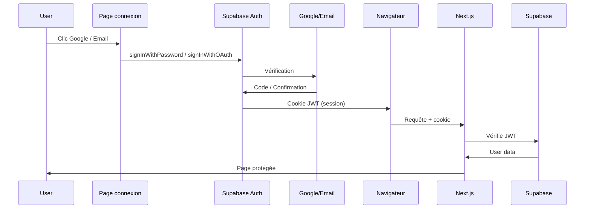

`Couche 3 — Backend & données`

# Authentification web

> Comprendre l'authentification dans une app Next.js : Supabase Auth, OAuth Google, magic link, sessions et protection des routes.

**Prérequis :** `C3-01` `C3-02` `C4-01` `T-GCLOUD01`

**Ce que tu vas apprendre :**
- La différence entre authentification et autorisation
- Comment Supabase Auth gère les sessions avec des cookies
- Comment protéger des routes dans Next.js

---

## 🟦 Carte d'identité

**Définition simple :**
> L'authentification, c'est le videur à l'entrée de la boîte de nuit. 
> Il vérifie ta carte d'identité (qui tu es). L'autorisation, c'est 
> le bracelet VIP (ce que tu as le droit de faire une fois dedans). 
> Sur le web, l'authentification vérifie ton email/mot de passe, 
> et l'autorisation décide si tu peux accéder au dashboard admin 
> ou juste au contenu public.

**Rôle technique :**
> L'authentification (auth) gère l'identité des utilisateurs : 
> inscription, connexion, déconnexion, et sessions. Supabase Auth 
> fournit plusieurs méthodes de connexion (OAuth, magic link, 
> email/password) et gère les sessions via des cookies JWT.

**Schéma** :
📸 à ajouter dans docs/

**Authentification vs Autorisation :**
| Concept | Question | Exemple |
|---------|----------|---------|
| Authentification | Qui es-tu ? | Connexion Google, magic link |
| Autorisation | Qu'as-tu le droit de faire ? | Admin vs utilisateur, RLS |

**Les méthodes de connexion :**
| Méthode | Comment ça marche | UX |
|---------|------------------|-----|
| OAuth Google | Clic → Google consent → session | Rapide, 2 clics |
| Magic Link | Email → lien cliquable → session | Simple, pas de mot de passe |
| Email / Password | Inscription classique | Familier, mais mot de passe à gérer |

---

## 🟩 Sous le capot

**Mécanisme — Le flow complet d'une connexion :**
> 1. L'utilisateur clique "Continuer avec Google" ou entre son email
> 2. Supabase Auth vérifie l'identité (via Google ou magic link)
> 3. Supabase crée un JWT (JSON Web Token) contenant l'identité
> 4. Le JWT est stocké dans un cookie httpOnly côté navigateur
> 5. À chaque requête, le cookie est envoyé automatiquement
> 6. Le serveur Next.js vérifie le JWT pour savoir qui est connecté
> 7. Si le JWT expire, l'utilisateur est redirigé vers /connexion

**Architecture auth dans Next.js + Supabase :**
```
src/
├── lib/
│   ├── supabase-client.ts   ← Client Components (navigateur)
│   └── supabase-server.ts   ← Server Components (serveur)
├── app/
│   ├── auth/
│   │   └── callback/
│   │       └── route.ts     ← Callback OAuth (échange code → session)
│   └── connexion/
│       └── page.tsx         ← Page de connexion
└── components/
    └── auth/
        └── AuthButton.tsx   ← Boutons Google + Magic Link
```

**Pourquoi deux clients Supabase ?**
| Client | Fichier | Contexte | Cookies |
|--------|---------|----------|---------|
| Browser | `supabase-client.ts` | Client Components | Lit les cookies du navigateur |
| Server | `supabase-server.ts` | Server Components, API routes | Lit les cookies de la requête HTTP |

**Protéger une route (middleware) — implémenté dans eticlab-app :**
```ts
// src/middleware.ts
import { createServerClient } from "@supabase/ssr";
import { NextResponse } from "next/server";
import type { NextRequest } from "next/server";

const protectedRoutes = ["/arbre", "/dashboard"];

export async function middleware(request: NextRequest) {
  const response = NextResponse.next({
    request: { headers: request.headers },
  });

  const supabase = createServerClient(
    process.env.NEXT_PUBLIC_SUPABASE_URL!,
    process.env.NEXT_PUBLIC_SUPABASE_ANON_KEY!,
    {
      cookies: {
        getAll() { return request.cookies.getAll() },
        setAll(cookiesToSet) {
          cookiesToSet.forEach(({ name, value, options }) => {
            request.cookies.set(name, value);
            response.cookies.set(name, value, options);
          });
        },
      },
    }
  );

  const { data: { user } } = await supabase.auth.getUser();

  const isProtected = protectedRoutes.some((route) =>
    request.nextUrl.pathname.startsWith(route)
  );

  if (isProtected && !user) {
    const url = request.nextUrl.clone();
    url.pathname = "/connexion";
    return NextResponse.redirect(url);
  }

  return response;
}

export const config = {
  matcher: ["/arbre/:path*", "/dashboard/:path*"],
};
```

**Session persistante (30 jours) :**
```ts
// src/lib/supabase-client.ts
import { createBrowserClient } from '@supabase/ssr'

export function createClient() {
  return createBrowserClient(
    process.env.NEXT_PUBLIC_SUPABASE_URL!,
    process.env.NEXT_PUBLIC_SUPABASE_ANON_KEY!,
    {
      auth: {
        persistSession: true,    // session stockée dans les cookies
        autoRefreshToken: true,  // refresh automatique avant expiration
      },
    }
  )
}
```
> Supabase gère le refresh token automatiquement. Avec ces options, 
> la session reste active ~30 jours sans que l'utilisateur ait à 
> se reconnecter.

**Page de réinitialisation du mot de passe :**
> Route `/reset-password` — champ email, envoi du lien via 
> `supabase.auth.resetPasswordForEmail()`, message de confirmation.
> Le lien redirige vers `/auth/callback` puis vers la page d'accueil.

**Toggle afficher/masquer mot de passe :**
> Bouton 👁️/🙈 dans les champs mot de passe qui bascule 
> `type="password"` ↔ `type="text"` via un state `showPassword`.
```

**Récupérer l'utilisateur côté serveur :**
```tsx
// Dans un Server Component
import { createClient } from '@/lib/supabase-server'

export default async function DashboardPage() {
  const supabase = await createClient()
  const { data: { user } } = await supabase.auth.getUser()
  
  if (!user) redirect('/connexion')
  
  return <h1>Bonjour {user.email}</h1>
}
```

**Outils d'observation :**
```bash
# Voir les utilisateurs dans Supabase
# Dashboard → Authentication → Users

# Voir les cookies de session dans Chrome
# F12 → Application → Cookies → localhost

# Vérifier la session active
# Console navigateur :
# const { data } = await supabase.auth.getSession()
# console.log(data)
```

**Schéma technique** :


---

## 🟥 Laboratoire de test

**POC 1 — Connexion email / mot de passe :**
> 1. Lance `npm run dev`
> 2. Va sur /connexion → onglet "Créer un compte"
> 3. Entre prénom, email, mot de passe (min. 6 caractères)
> 4. Message : "Vérifie ta boîte mail pour confirmer ton compte"
> 5. Confirme → reviens sur /connexion → onglet "Se connecter"
> 6. Après login → redirect vers /arbre

**POC 2 — Connexion Google :**
> 1. Configure le provider Google dans Supabase (voir T-GCLOUD01)
> 2. Clique "Continuer avec Google" sur /connexion
> 3. Autorise l'app sur le consent screen Google
> 4. Vérifie la session dans Supabase Dashboard → Users

**POC 3 — Vérifier la session dans DevTools :**
> 1. F12 → Application → Cookies
> 2. Cherche les cookies `sb-*` (Supabase session)
> 3. F12 → Console : tape `document.cookie`
> 4. Les cookies httpOnly ne sont PAS visibles ici (c'est normal)

**POC 4 — Réinitialisation du mot de passe :**
> 1. Va sur /connexion → "Mot de passe oublié ?"
> 2. Entre ton email sur /reset-password
> 3. Message : "Lien envoyé ! Vérifie ta boîte mail"
> 4. Supabase envoie un email avec un lien de reset

**POC 5 — Toggle afficher/masquer mot de passe :**
> Sur /connexion, clique l'icône 👁️ à droite du champ mot de passe.
> Le champ passe de `type="password"` à `type="text"` et vice-versa.

**Test de panne :**
> Supprime les cookies Supabase dans DevTools :
> → La navbar passe en mode "non connecté"
> → /arbre redirige vers /connexion (middleware)
> → Reconnecte-toi pour restaurer la session

**Commande clé à retenir :**
```bash
# Vérifier les utilisateurs dans Supabase
# Dashboard → Authentication → Users
```

---

## 💀 Zone de hack

**Vulnérabilité classique — session hijacking :**
> Si un attaquant vole le cookie de session (via XSS ou réseau 
> non chiffré), il peut se faire passer pour l'utilisateur. 
> C'est pourquoi les cookies doivent être httpOnly (pas lisibles 
> par JavaScript) et secure (envoyés uniquement en HTTPS).

**Autre risque — pas de vérification côté serveur :**
> Ne jamais faire confiance au client pour l'auth. Toujours 
> vérifier la session côté serveur avec `getUser()`, pas 
> `getSession()` (qui lit le JWT local sans vérifier auprès 
> de Supabase).

**Contre-mesure :**
> - Utiliser `getUser()` (vérifie auprès de Supabase) et non 
>   `getSession()` (lit le JWT local, peut être expiré/falsifié)
> - Les cookies Supabase sont déjà httpOnly et secure par défaut
> - Toujours HTTPS en production (Vercel le fait automatiquement)
> - Middleware pour protéger les routes sensibles côté serveur

---

## 🔄 Alternatives

| Outil | Gratuit | Open Source | Freemium | Premium | Limites |
|-------|---------|-------------|----------|---------|---------|
| Supabase Auth | ✅ | ✅ | ✅ | — | 50K MAU gratuits |
| Clerk | ✅ | — | ✅ | ✅ | 10K MAU gratuits, UI pré-faite |
| NextAuth.js (Auth.js) | ✅ | ✅ | — | — | Config manuelle, pas de dashboard |
| Auth0 | ✅ | — | ✅ | ✅ | 7500 users gratuits |
| Firebase Auth | ✅ | — | ✅ | — | Vendor lock-in Google |
| Lucia Auth | ✅ | ✅ | — | — | Arrêté, pas recommandé |

> **Recommandation EticLab :** Supabase Auth — déjà dans la stack, 
> OAuth + magic link intégrés, 50K utilisateurs actifs gratuits par mois. 
> Pas besoin de service tiers. Si tu veux du UI pré-construit (formulaires, 
> composants), Clerk est une bonne alternative mais payant au-delà de 10K users.

---

## ✅ Checklist de validation

- [ ] Est-ce que je sais la différence entre authentification et autorisation ?
- [ ] Est-ce que je sais pourquoi utiliser `getUser()` et pas `getSession()` ?
- [ ] Est-ce que je sais protéger une route avec un middleware Next.js ?
- [ ] Est-ce que je sais où sont stockés les cookies de session ?

---

## 🧰 Toolbox

| Outil | Usage | Prix | Risque |
|-------|-------|------|--------|
| Supabase Auth | Authentification complète | Gratuit (plan free) | Aucun |
| Chrome DevTools (Application) | Voir les cookies | Gratuit | Aucun |
| Supabase Dashboard (Users) | Gérer les utilisateurs | Gratuit | Aucun |
| jwt.io | Décoder un JWT | Gratuit | Ne jamais coller un vrai token |

---

## 📚 Aller plus loin

- [Supabase — Auth with Next.js](https://supabase.com/docs/guides/auth/server-side/nextjs)
- [Next.js — Middleware documentation](https://nextjs.org/docs/app/building-your-application/routing/middleware)

## Liens avec d'autres modules
- → T-GCLOUD01 : configuration OAuth Google dans GCP
- → C4-01-supabase : Supabase Auth est un service de Supabase
- → C3-02-routing : protection des routes via middleware
- → T-SEC01-securite : cookies, JWT, session hijacking
- → C5-01-vercel : HTTPS automatique pour les cookies secure
