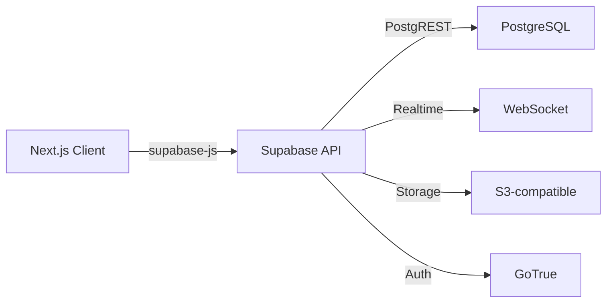

`Couche 4 — Frontend & données`

# Supabase (base de données)

> Comprendre ce qu'est une base de données PostgreSQL, comment Supabase la rend accessible via une API, et comment l'utiliser dans un projet Next.js.

**Prérequis :** `C3-01` `C1-02` `T-01b`

**Ce que tu vas apprendre :**
- Ce qu'est une base de données relationnelle (tables, lignes, colonnes)
- Comment Supabase transforme PostgreSQL en API instantanée
- Comment connecter Supabase à un projet Next.js

---

## 🟦 Carte d'identité

**Définition simple :**
> Imagine un tableur Excel en ligne. Chaque onglet est une "table", 
> chaque ligne est un enregistrement, chaque colonne est un champ 
> (nom, email, date...). La base de données, c'est ce tableur — 
> mais en beaucoup plus puissant : elle peut stocker des millions 
> de lignes, les filtrer en millisecondes, et être interrogée par 
> ton application via une API. Supabase, c'est le service qui 
> héberge ce tableur et te donne une API pour le manipuler.

**Rôle technique :**
> Supabase est une plateforme open source qui fournit une base 
> de données PostgreSQL avec une API REST et temps réel générée 
> automatiquement. Tu crées des tables dans le Studio (interface web), 
> et Supabase génère instantanément les endpoints API pour lire, 
> écrire, modifier et supprimer des données — sans écrire de backend.

**Schéma** :
📸 à ajouter dans docs/

**Ce que Supabase inclut :**
| Service | Rôle | Équivalent Firebase |
|---------|------|---------------------|
| Database | Base PostgreSQL complète | Cloud Firestore |
| Auth | Authentification (email, OAuth, magic link) | Firebase Auth |
| Storage | Stockage de fichiers (images, PDF) | Cloud Storage |
| Edge Functions | Fonctions serverless (Deno) | Cloud Functions |
| Realtime | Écouter les changements en temps réel | Realtime Database |

**Ce que Supabase n'est PAS :**
- Ce n'est pas un framework (c'est un service backend)
- Ce n'est pas obligatoire (on peut utiliser PostgreSQL directement)
- Ce n'est pas illimité en gratuit (500 MB de données, 1 GB de stockage, 
  2 projets actifs max en plan gratuit)

**Schéma mental :**
```
Ton app Next.js
    ↓ requête API
Supabase (API auto-générée)
    ↓ traduit en SQL
PostgreSQL (la vraie base de données)
    ↓ retourne les données
Supabase → ton app → affichage
```

---

## 🟩 Sous le capot

**Mécanisme :**
> 1. Tu crées un projet sur supabase.com (ou via Vercel Marketplace)
> 2. Tu crées des tables dans le Studio (interface visuelle)
> 3. Supabase génère automatiquement une API REST pour chaque table
> 4. Tu installes `@supabase/supabase-js` dans ton projet Next.js
> 5. Tu utilises le client Supabase pour lire/écrire dans la base
> 6. Les Row Level Security (RLS) policies protègent tes données

**Créer un projet Supabase :**
```
1. Aller sur supabase.com → New Project
2. Choisir une organisation
3. Nom du projet, mot de passe base de données, région
4. Attendre ~2 minutes le provisioning
5. Récupérer les clés dans Settings → API :
   - Project URL (NEXT_PUBLIC_SUPABASE_URL)
   - anon key (NEXT_PUBLIC_SUPABASE_ANON_KEY)
```

**Installer le client dans Next.js :**
```bash
npm install @supabase/supabase-js
```

**Configurer le client :**
```ts
// lib/supabase.ts
import { createClient } from '@supabase/supabase-js';

const supabaseUrl = process.env.NEXT_PUBLIC_SUPABASE_URL!;
const supabaseKey = process.env.NEXT_PUBLIC_SUPABASE_ANON_KEY!;

export const supabase = createClient(supabaseUrl, supabaseKey);
```

**Les opérations CRUD :**
```ts
// CREATE — insérer une ligne
const { data, error } = await supabase
  .from('modules')
  .insert({ code: 'C4-01', titre: 'Supabase', statut: 'done' });

// READ — lire toutes les lignes
const { data, error } = await supabase
  .from('modules')
  .select('*');

// READ — lire avec filtre
const { data, error } = await supabase
  .from('modules')
  .select('*')
  .eq('statut', 'done');

// UPDATE — modifier une ligne
const { data, error } = await supabase
  .from('modules')
  .update({ statut: 'done' })
  .eq('code', 'C4-01');

// DELETE — supprimer une ligne
const { data, error } = await supabase
  .from('modules')
  .delete()
  .eq('code', 'C4-01');
```

**Outils d'observation :**
```bash
# Voir les variables Supabase dans ton projet
cat .env.local | grep SUPABASE

# Tester l'API directement avec curl
curl "https://[PROJECT_REF].supabase.co/rest/v1/modules?select=*" \
  -H "apikey: [ANON_KEY]" \
  -H "Authorization: Bearer [ANON_KEY]"
```

**Schéma technique** :


**Comprendre SQL vs API Supabase :**
| SQL | Supabase JS |
|-----|-------------|
| `SELECT * FROM modules` | `supabase.from('modules').select('*')` |
| `WHERE statut = 'done'` | `.eq('statut', 'done')` |
| `INSERT INTO modules (...)` | `.insert({ ... })` |
| `UPDATE modules SET ...` | `.update({ ... })` |
| `DELETE FROM modules` | `.delete()` |
| `ORDER BY created_at DESC` | `.order('created_at', { ascending: false })` |
| `LIMIT 10` | `.limit(10)` |

---

## 🟥 Laboratoire de test

**POC 1 — Créer une table dans le Studio :**
> 1. Ouvre le Studio de ton projet Supabase
> 2. Table Editor → New Table
> 3. Nom : `modules`
> 4. Colonnes :
>    - `id` (int8, primary key, auto-increment)
>    - `code` (text, ex: "C1-01")
>    - `titre` (text, ex: "Ports")
>    - `statut` (text, ex: "done" ou "todo")
>    - `created_at` (timestamptz, default: now())
> 5. Ajoute quelques lignes manuellement

**POC 2 — Lire des données depuis Next.js :**
```tsx
// app/labo/supabase/page.tsx
import { supabase } from '@/lib/supabase';

export default async function SupabaseLabo() {
  const { data: modules, error } = await supabase
    .from('modules')
    .select('*')
    .order('code');

  if (error) return <p>Erreur : {error.message}</p>;

  return (
    <div style={{ padding: '2rem', fontFamily: 'sans-serif' }}>
      <h1>Modules depuis Supabase</h1>
      {modules?.map((m) => (
        <div key={m.id}>
          {m.statut === 'done' ? '✅' : '🔲'} 
          <strong>{m.code}</strong> — {m.titre}
        </div>
      ))}
    </div>
  );
}
```

**POC 3 — Tester l'API avec curl :**
```bash
# Remplace [URL] et [KEY] par tes valeurs
curl "https://[URL].supabase.co/rest/v1/modules?select=*" \
  -H "apikey: [KEY]" \
  -H "Authorization: Bearer [KEY]"
```

**Test de panne :**
> Mets un mauvais `SUPABASE_URL` dans `.env.local` :
> → L'app affiche une erreur de connexion
> → Les données ne chargent plus
> → Remet la bonne URL → tout revient

**Commande clé à retenir :**
```bash
npm install @supabase/supabase-js
```

---

## 💀 Zone de hack

**Vulnérabilité classique — RLS désactivé :**
> Par défaut, Supabase crée les tables avec Row Level Security (RLS) 
> désactivé. Ça veut dire que n'importe qui avec ta clé anon 
> peut lire, modifier et supprimer TOUTES les données.
> La clé anon est dans le code client (visible par tous).

**Vérification :**
```sql
-- Dans le SQL Editor de Supabase, vérifie le RLS
SELECT tablename, rowsecurity 
FROM pg_tables 
WHERE schemaname = 'public';

-- Si rowsecurity = false : DANGER
```

**Exemple d'attaque :**
> Un attaquant ouvre les DevTools, trouve ta clé anon dans le 
> code source, et fait :
```bash
curl -X DELETE "https://[URL].supabase.co/rest/v1/modules?id=gt.0" \
  -H "apikey: [ANON_KEY]" \
  -H "Authorization: Bearer [ANON_KEY]"
# → Toutes les lignes supprimées
```

**Contre-mesure :**
> - TOUJOURS activer RLS sur chaque table
> - Créer des policies qui définissent qui peut lire/écrire quoi
> - La clé anon est publique par design — c'est RLS qui protège
> - Pour les opérations admin, utiliser la service_role key (côté serveur uniquement)

```sql
-- Activer RLS
ALTER TABLE modules ENABLE ROW LEVEL SECURITY;

-- Policy : tout le monde peut lire
CREATE POLICY "Lecture publique" ON modules
  FOR SELECT USING (true);

-- Policy : seuls les admins peuvent écrire
CREATE POLICY "Écriture admin" ON modules
  FOR INSERT WITH CHECK (auth.role() = 'authenticated');
```

---

## 🔄 Alternatives

| Outil | Gratuit | Open Source | Freemium | Premium | Limites |
|-------|---------|-------------|----------|---------|---------|
| Supabase | ✅ | ✅ | ✅ | ✅ | 500 MB gratuit, 2 projets, pause après 7 jours inactifs |
| Firebase (Google) | ✅ | — | ✅ | ✅ | NoSQL (pas SQL), vendor lock-in Google |
| Neon | ✅ | ✅ | ✅ | ✅ | PostgreSQL serverless, pas d'auth/storage intégré |
| PlanetScale | — | — | ✅ | ✅ | MySQL (pas PostgreSQL), plan gratuit supprimé |
| MongoDB Atlas | ✅ | ✅ | ✅ | ✅ | NoSQL (documents), pas de SQL, requêtes différentes |
| Turso (libSQL) | ✅ | ✅ | ✅ | — | SQLite distribué, écosystème jeune |

> **Recommandation EticLab :** Supabase — c'est dans la stack (Reflety 
> et Benny l'utilisent). PostgreSQL est le standard, l'API est auto-générée, 
> et le plan gratuit suffit pour apprendre. Intégration Vercel Marketplace 
> disponible. Attention : mettre Benny en pause avant de créer le projet 
> EticLab (limite de 2 projets gratuits).

---

## ✅ Checklist de validation

- [ ] Est-ce que je sais créer une table dans le Studio Supabase ?
- [ ] Est-ce que je sais lire des données avec `supabase.from().select()` ?
- [ ] Est-ce que je sais pourquoi RLS est obligatoire ?
- [ ] Est-ce que je sais la différence entre anon key et service_role key ?

---

## 🧰 Toolbox

| Outil | Usage | Prix | Risque |
|-------|-------|------|--------|
| Supabase Studio | Interface visuelle pour la base | Gratuit, intégré | Aucun |
| @supabase/supabase-js | Client JavaScript | Gratuit, open source | Version à jour importante |
| SQL Editor (Studio) | Écrire du SQL directement | Gratuit, intégré | Requêtes destructrices |
| Supabase CLI | Dev local, migrations | Gratuit, open source | Config complexe |
| Table Plus | GUI pour PostgreSQL | Freemium | Aucun |

---

## 📚 Aller plus loin

- [Supabase — documentation officielle](https://supabase.com/docs)
- [Supabase + Next.js — guide officiel](https://supabase.com/docs/guides/getting-started/quickstarts/nextjs)
- [PostgreSQL — tutoriel SQL](https://www.postgresqltutorial.com)

## Liens avec d'autres modules
- → C3-01-nextjs : Supabase s'intègre dans Next.js via le client JS
- → C3-03-composants-ui : les composants affichent les données Supabase
- → C1-02-http : Supabase expose une API REST sur HTTP
- → C4-02-api : les API routes Next.js peuvent appeler Supabase côté serveur
- → C5-01-vercel : Supabase est disponible sur le Vercel Marketplace
