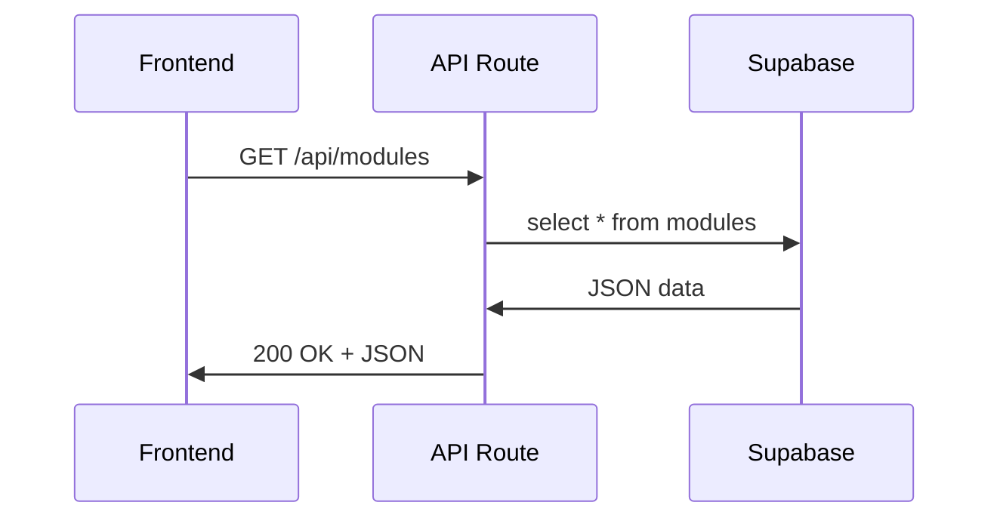

`Couche 4 — Frontend & données`

# API REST

> Comprendre ce qu'est une API, comment fonctionne le protocole REST, et comment Next.js crée des API routes.

**Prérequis :** `C1-02` `C3-01` `C4-01`

**Ce que tu vas apprendre :**
- Ce qu'est une API et pourquoi c'est le pont entre frontend et backend
- Les 4 méthodes HTTP (GET, POST, PUT, DELETE) et quand les utiliser
- Comment créer des API routes dans Next.js

---

## 🟦 Carte d'identité

**Définition simple :**
> Imagine un restaurant. Toi (le frontend), tu es le client. 
> La cuisine (le backend/la base de données), c'est là où les 
> plats sont préparés. L'API, c'est le serveur : tu lui donnes 
> ta commande (requête), il va en cuisine, et il revient avec 
> ton plat (réponse). Tu ne vas jamais en cuisine directement — 
> c'est l'API qui fait l'intermédiaire.

**Rôle technique :**
> Une API (Application Programming Interface) est un ensemble 
> de règles qui permettent à deux programmes de communiquer. 
> REST (Representational State Transfer) est un style 
> d'architecture pour les API web, basé sur HTTP. Chaque 
> ressource a une URL, et on utilise les méthodes HTTP 
> pour agir dessus.

**Schéma** :
📸 à ajouter dans docs/

**Les 4 méthodes HTTP (CRUD) :**
| Méthode | Action | SQL équivalent | Exemple |
|---------|--------|----------------|---------|
| GET | Lire des données | SELECT | Récupérer la liste des modules |
| POST | Créer une donnée | INSERT | Ajouter un nouveau module |
| PUT/PATCH | Modifier une donnée | UPDATE | Changer le statut d'un module |
| DELETE | Supprimer une donnée | DELETE | Supprimer un module |

**Ce qu'une API REST n'est PAS :**
- Ce n'est pas un langage (c'est un style d'architecture)
- Ce n'est pas obligatoirement JSON (mais c'est le standard)
- Ce n'est pas la seule façon de faire (GraphQL, gRPC, tRPC existent)

**Schéma mental :**
```
Frontend (React)
    ↓ fetch('/api/modules')  ← requête HTTP
API Route (Next.js)
    ↓ supabase.from('modules').select()
Base de données (Supabase/PostgreSQL)
    ↓ retourne les données
API Route → Frontend → affichage
```

---

## 🟩 Sous le capot

**Mécanisme :**
> 1. Le frontend envoie une requête HTTP (ex: GET /api/modules)
> 2. Next.js reçoit la requête et l'envoie au bon fichier `route.ts`
> 3. Le code dans `route.ts` traite la requête (lecture BDD, calcul, etc.)
> 4. Il retourne une réponse JSON avec un code de statut (200, 404, 500)
> 5. Le frontend reçoit le JSON et l'affiche

**Anatomie d'une requête API :**
```
GET /api/modules HTTP/1.1        ← méthode + URL
Host: localhost:3000              ← serveur
Accept: application/json          ← format attendu
Authorization: Bearer [token]     ← authentification (optionnel)
```

**Anatomie d'une réponse API :**
```
HTTP/1.1 200 OK                   ← code de statut
Content-Type: application/json    ← format de la réponse

[
  { "code": "C1-01", "titre": "Ports", "statut": "done" },
  { "code": "C4-02", "titre": "API REST", "statut": "done" }
]
```

**Créer une API route dans Next.js (App Router) :**
```ts
// app/api/modules/route.ts

import { NextResponse } from 'next/server';
import { supabase } from '@/lib/supabase';

// GET /api/modules — lire tous les modules
export async function GET() {
  const { data, error } = await supabase
    .from('modules')
    .select('*')
    .order('code');

  if (error) {
    return NextResponse.json(
      { error: error.message }, 
      { status: 500 }
    );
  }

  return NextResponse.json(data);
}

// POST /api/modules — créer un module
export async function POST(request: Request) {
  const body = await request.json();

  const { data, error } = await supabase
    .from('modules')
    .insert(body)
    .select()
    .single();

  if (error) {
    return NextResponse.json(
      { error: error.message }, 
      { status: 400 }
    );
  }

  return NextResponse.json(data, { status: 201 });
}
```

**Route dynamique avec paramètre :**
```ts
// app/api/modules/[code]/route.ts

import { NextResponse } from 'next/server';
import { supabase } from '@/lib/supabase';

// GET /api/modules/C1-01
export async function GET(
  request: Request,
  { params }: { params: { code: string } }
) {
  const { data, error } = await supabase
    .from('modules')
    .select('*')
    .eq('code', params.code)
    .single();

  if (error) {
    return NextResponse.json(
      { error: 'Module non trouvé' }, 
      { status: 404 }
    );
  }

  return NextResponse.json(data);
}

// DELETE /api/modules/C1-01
export async function DELETE(
  request: Request,
  { params }: { params: { code: string } }
) {
  const { error } = await supabase
    .from('modules')
    .delete()
    .eq('code', params.code);

  if (error) {
    return NextResponse.json(
      { error: error.message }, 
      { status: 500 }
    );
  }

  return NextResponse.json({ message: 'Supprimé' });
}
```

**Outils d'observation :**
```bash
# Tester une API avec curl
curl http://localhost:3000/api/modules

# Créer un module via POST
curl -X POST http://localhost:3000/api/modules \
  -H "Content-Type: application/json" \
  -d '{"code":"C4-02","titre":"API REST","statut":"done"}'

# Supprimer un module
curl -X DELETE http://localhost:3000/api/modules/C4-02

# Voir les headers de la réponse
curl -I http://localhost:3000/api/modules
```

**Schéma technique** :


**Les codes de statut pour les API :**
| Code | Signification | Quand l'utiliser |
|------|---------------|-----------------|
| 200 | OK | Lecture réussie |
| 201 | Created | Création réussie |
| 400 | Bad Request | Données invalides envoyées |
| 401 | Unauthorized | Pas authentifié |
| 403 | Forbidden | Authentifié mais pas autorisé |
| 404 | Not Found | Ressource inexistante |
| 500 | Internal Server Error | Bug côté serveur |

---

## 🟥 Laboratoire de test

**POC 1 — API route simple (sans base de données) :**
> Crée `app/api/hello/route.ts` :
```ts
import { NextResponse } from 'next/server';

export async function GET() {
  return NextResponse.json({
    message: 'Bonjour depuis l\'API !',
    timestamp: new Date().toISOString()
  });
}
```
```bash
curl http://localhost:3000/api/hello
# → {"message":"Bonjour depuis l'API !","timestamp":"..."}
```

**POC 2 — API route connectée à Supabase :**
> Crée `app/api/modules/route.ts` avec le code de la section 
> "Sous le capot", puis teste avec curl.

**POC 3 — Appeler l'API depuis un composant React :**
```tsx
"use client";
import { useState, useEffect } from 'react';

export default function ModulesAPI() {
  const [modules, setModules] = useState([]);

  useEffect(() => {
    fetch('/api/modules')
      .then(res => res.json())
      .then(data => setModules(data));
  }, []);

  return (
    <div>
      <h1>Modules (via API)</h1>
      {modules.map((m: any) => (
        <p key={m.code}>{m.code} — {m.titre}</p>
      ))}
    </div>
  );
}
```

**Test de panne :**
> Appelle une route qui n'existe pas :
```bash
curl http://localhost:3000/api/inexistant
# → 404 Not Found
```
> Envoie des données invalides en POST :
```bash
curl -X POST http://localhost:3000/api/modules \
  -H "Content-Type: application/json" \
  -d '{}'
# → 400 Bad Request (si tu valides les données)
```

**Commande clé à retenir :**
```bash
curl http://localhost:3000/api/modules
```

---

## 💀 Zone de hack

**Vulnérabilité classique — API sans validation des entrées :**
> Si tu ne valides pas ce que le client envoie en POST/PUT, 
> un attaquant peut injecter n'importe quoi dans ta base 
> de données — y compris du SQL malveillant ou des données 
> qui cassent ton application.

**Exemple d'attaque :**
```bash
# Envoyer des données inattendues
curl -X POST http://localhost:3000/api/modules \
  -H "Content-Type: application/json" \
  -d '{"code":"<script>alert(1)</script>","titre":"hack"}'
```

**Autre risque — API sans authentification :**
> Si tes API routes sont publiques et modifient des données, 
> n'importe qui peut les appeler. Pas besoin d'être sur ton 
> site — un simple curl suffit.

**Contre-mesure :**
> - Toujours valider les entrées (type, format, longueur)
> - Utiliser une librairie de validation (zod est le standard Next.js)
> - Protéger les routes sensibles avec un middleware d'authentification
> - Ne jamais faire confiance aux données du client
> - Limiter le nombre de requêtes (rate limiting)

```ts
// Exemple de validation avec zod
import { z } from 'zod';

const ModuleSchema = z.object({
  code: z.string().min(1).max(10),
  titre: z.string().min(1).max(100),
  statut: z.enum(['done', 'todo'])
});

export async function POST(request: Request) {
  const body = await request.json();
  const result = ModuleSchema.safeParse(body);
  
  if (!result.success) {
    return NextResponse.json(
      { error: result.error.issues }, 
      { status: 400 }
    );
  }
  // ... continuer avec result.data (données validées)
}
```

---

## 🔄 Alternatives

| Outil | Gratuit | Open Source | Freemium | Premium | Limites |
|-------|---------|-------------|----------|---------|---------|
| REST (HTTP + JSON) | ✅ | ✅ | — | — | Verbose, over-fetching possible |
| GraphQL | ✅ | ✅ | — | — | Complexe, courbe d'apprentissage |
| tRPC | ✅ | ✅ | — | — | TypeScript only, full-stack only |
| gRPC | ✅ | ✅ | — | — | Binaire (pas JSON), complexe, pas pour le web |
| Supabase API auto | ✅ | ✅ | ✅ | — | Lié à Supabase, moins de contrôle |

> **Recommandation EticLab :** REST — c'est le standard universel, 
> simple à comprendre et à tester avec curl. L'API auto-générée de 
> Supabase est du REST. Les API routes Next.js sont du REST. 
> Pas besoin de GraphQL ou tRPC pour commencer — ça ajoute de la 
> complexité sans bénéfice pour un projet de cette taille.

---

## ✅ Checklist de validation

- [ ] Est-ce que je sais expliquer ce qu'est une API REST ?
- [ ] Est-ce que je connais les 4 méthodes HTTP (GET, POST, PUT, DELETE) ?
- [ ] Est-ce que je sais créer une API route dans Next.js ?
- [ ] Est-ce que je sais pourquoi valider les entrées est obligatoire ?

---

## 🧰 Toolbox

| Outil | Usage | Prix | Risque |
|-------|-------|------|--------|
| curl | Tester les API en terminal | Gratuit, intégré | Aucun |
| Bruno | Client API graphique | Gratuit, open source | Moins connu |
| Postman | Client API complet | Freemium | Lourd, compte requis |
| DevTools Network | Observer les appels API | Gratuit, intégré | Aucun |
| zod | Validation des données TypeScript | Gratuit, open source | Aucun |

---

## 📚 Aller plus loin

- [MDN — HTTP Methods](https://developer.mozilla.org/fr/docs/Web/HTTP/Methods)
- [Next.js — Route Handlers](https://nextjs.org/docs/app/building-your-application/routing/route-handlers)
- [zod — documentation](https://zod.dev)

## Liens avec d'autres modules
- → C1-02-http : les API utilisent le protocole HTTP
- → C3-01-nextjs : les API routes sont une feature de Next.js
- → C3-02-routing : les fichiers route.ts suivent le même système de routing
- → C4-01-supabase : les API routes appellent Supabase côté serveur
- → C1-04-ssl : les API en production sont protégées par HTTPS
