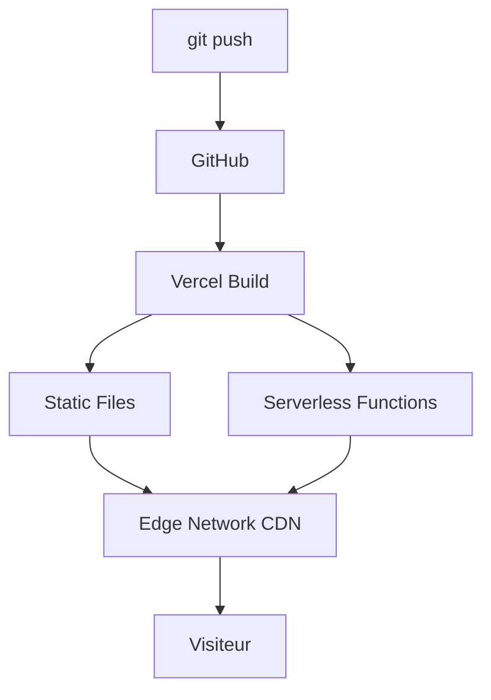

`Couche 5 — Mise en ligne & production`

# Vercel (déploiement)

> Comprendre comment déployer une application Next.js sur Vercel, gérer les variables d'environnement en production, et comment fonctionne l'hébergement serverless.

**Prérequis :** `C3-01` `C1-03` `C1-04` `T-03`

**Ce que tu vas apprendre :**
- Comment Vercel déploie automatiquement depuis GitHub
- La différence entre Preview et Production
- Comment fonctionnent les Serverless Functions et le Edge Network

---

## 🟦 Carte d'identité

**Définition simple :**
> Imagine que tu as construit une maquette Lego (ton site Next.js) 
> sur ta table (localhost). Vercel, c'est la vitrine du magasin : 
> tu lui donnes ta maquette, et il la met en vitrine pour que 
> tout le monde puisse la voir. En plus, il fait des copies 
> dans toutes les vitrines du monde (CDN) pour que chaque 
> visiteur voie la maquette la plus proche de chez lui.

**Rôle technique :**
> Vercel est une plateforme d'hébergement optimisée pour Next.js. 
> Elle automatise le déploiement : à chaque `git push`, Vercel 
> build et déploie ton application. Elle fournit un CDN global, 
> des Serverless Functions, le SSL automatique, et des previews 
> pour chaque pull request.

**Schéma** :
📸 à ajouter dans docs/

**Ce que Vercel fait automatiquement :**
| Fonctionnalité | Ce que ça fait | Manuel sans Vercel |
|----------------|----------------|-------------------|
| Build | Compile ton code Next.js | Tu dois configurer un serveur CI |
| CDN | Distribue sur ~300 serveurs | Tu dois configurer Cloudflare |
| SSL/HTTPS | Certificat automatique | Tu dois installer certbot |
| Preview | URL unique par branche/PR | Tu n'en as pas |
| Serverless | Exécute le code backend | Tu dois gérer un serveur Node.js |
| Rollback | Revenir à une version précédente | Tu dois gérer les versions toi-même |

**Ce que Vercel n'est PAS :**
- Ce n'est pas un hébergeur classique (pas de serveur SSH)
- Ce n'est pas gratuit pour tout (limites sur le plan Hobby)
- Ce n'est pas la seule option (Netlify, Railway, etc.)

**Schéma mental :**
```
git push → GitHub → Vercel détecte le push
                      ↓
                    Build (npm run build)
                      ↓
                    Déploiement
                      ↓
               Preview (branche)  ou  Production (main)
                      ↓
               URL unique générée
                      ↓
            CDN mondial + Serverless Functions
```

---

## 🟩 Sous le capot

**Mécanisme :**
> 1. Tu connectes ton repo GitHub à un projet Vercel
> 2. À chaque `git push`, Vercel clone ton repo et lance `npm run build`
> 3. Le build crée des fichiers statiques + des Serverless Functions
> 4. Vercel déploie le tout sur son Edge Network (~300 PoP)
> 5. Si c'est la branche `main` → déploiement Production
> 6. Si c'est une autre branche/PR → déploiement Preview (URL temporaire)

**Les 3 types de déploiement :**
| Type | Quand | URL |
|------|-------|-----|
| Production | Push sur `main` | ton-site.vercel.app |
| Preview | Push sur une branche | ton-site-git-branche.vercel.app |
| Instant Rollback | Clic dans le dashboard | Restaure un ancien déploiement |

**Connecter un projet :**
```bash
# Installer le CLI Vercel
npm install -g vercel

# Lier ton projet local à Vercel
vercel link

# Déployer en preview
vercel

# Déployer en production
vercel --prod
```

**Variables d'environnement :**
> Les variables `.env.local` ne sont PAS envoyées à Vercel. 
> Il faut les configurer dans le dashboard :
```
Vercel Dashboard → Project → Settings → Environment Variables

3 scopes possibles :
- Production  → uniquement pour le déploiement prod
- Preview     → uniquement pour les previews
- Development → uniquement pour `vercel dev`
```

```bash
# Récupérer les variables Vercel en local
vercel env pull .env.local

# Ajouter une variable via le CLI
vercel env add NEXT_PUBLIC_SUPABASE_URL

# Lister les variables
vercel env ls
```

**Outils d'observation :**
```bash
# Voir les déploiements récents
vercel ls

# Voir les logs de build
vercel logs [URL_DU_DEPLOIEMENT]

# Voir les logs des Serverless Functions en temps réel
vercel logs --follow

# Inspecter un déploiement
vercel inspect [URL_DU_DEPLOIEMENT]
```

**Schéma technique** :


**Comment fonctionnent les Serverless Functions :**
> Chaque fichier `route.ts` dans `app/api/` devient une 
> Serverless Function. Elle ne tourne pas en permanence — 
> elle démarre quand une requête arrive, répond, et s'arrête.
```
Avantages :
  - Pas de serveur à gérer
  - Scale automatiquement (100 ou 100 000 requêtes)
  - Tu payes uniquement ce qui est exécuté

Inconvénients :
  - Cold start (premier appel plus lent ~200ms)
  - Timeout (10s en Hobby, 60s en Pro)
  - Pas de state persistant (pas de variable en mémoire entre requêtes)
```

**Les domaines :**
```bash
# Ajouter un domaine custom
vercel domains add mon-domaine.com

# Vérifier les DNS
vercel domains inspect mon-domaine.com

# Le SSL est automatique pour les domaines custom
```

---

## 🟥 Laboratoire de test

**POC 1 — Premier déploiement :**
```bash
cd ~/Dev/keticwork/ton-projet-nextjs
vercel
# → Réponds aux questions
# → URL de preview générée en ~30 secondes
```

**POC 2 — Déploiement depuis GitHub :**
> 1. Pousse ton projet sur GitHub
> 2. Va sur vercel.com → New Project → Import Git Repository
> 3. Sélectionne ton repo → Deploy
> 4. Vercel build et déploie automatiquement
> 5. Chaque futur `git push` déclenchera un nouveau déploiement

**POC 3 — Variables d'environnement :**
```bash
# Ajouter les clés Supabase à Vercel
vercel env add NEXT_PUBLIC_SUPABASE_URL
# → Colle la valeur
# → Choisis les scopes (Production, Preview, Development)

# Récupérer en local
vercel env pull .env.local
```

**POC 4 — Tester le Preview :**
```bash
# Crée une branche
git checkout -b test-preview

# Fais un changement
echo "// test" >> app/page.tsx

# Push
git add . && git commit -m "test preview" && git push -u origin test-preview

# → Vercel crée automatiquement une URL de preview
# → Visible dans le dashboard et dans la PR GitHub
```

**Test de panne :**
> Pousse un build qui échoue (erreur TypeScript volontaire) :
> → Vercel montre l'erreur dans les build logs
> → La production reste sur le dernier déploiement réussi
> → Aucun impact pour les visiteurs

**Commande clé à retenir :**
```bash
vercel --prod
```

---

## 💀 Zone de hack

**Vulnérabilité classique — variables d'environnement exposées :**
> Les variables `NEXT_PUBLIC_*` sont incluses dans le bundle 
> JavaScript côté client. Tout le monde peut les lire dans 
> le code source de ta page. Ne mets JAMAIS de secret dedans.

**Vérification :**
```bash
# Chercher les variables exposées dans le build
grep -r "NEXT_PUBLIC_" .next/static/

# Vérifier dans le dashboard Vercel
# Settings → Environment Variables
# Les clés sensibles NE doivent PAS avoir le préfixe NEXT_PUBLIC_
```

**Autre risque — Serverless Functions publiques :**
> Tes API routes (`/api/*`) sont publiques par défaut. 
> N'importe qui peut les appeler, pas seulement ton frontend.

**Contre-mesure :**
> - Secrets (clés API, database URL) → variables SANS préfixe `NEXT_PUBLIC_`
> - Clés publiques (Supabase anon, Stripe publishable) → `NEXT_PUBLIC_` OK
> - Protéger les API routes sensibles avec de l'authentification
> - Utiliser les scopes de variables (Production ≠ Preview ≠ Development)
> - Ne jamais hardcoder de secrets dans le code

---

## 🔄 Alternatives

| Outil | Gratuit | Open Source | Freemium | Premium | Limites |
|-------|---------|-------------|----------|---------|---------|
| Vercel | ✅ | — | ✅ | ✅ (Pro 20$/mois) | Optimisé Next.js, timeout 10s en gratuit |
| Netlify | ✅ | — | ✅ | ✅ | Bon pour du statique, moins optimisé Next.js |
| Railway | ✅ | — | ✅ | ✅ | Docker-based, bon pour du backend, 5$ de crédit gratuit |
| Render | ✅ | — | ✅ | ✅ | Polyvalent, spin-down en gratuit (lent au réveil) |
| Fly.io | ✅ | — | ✅ | ✅ | Edge computing, plus complexe à configurer |
| VPS (Hetzner) | — | — | — | ✅ (3-5€/mois) | Contrôle total, maintenance manuelle, pas de CI/CD auto |

> **Recommandation EticLab :** Vercel Pro — c'est dans la stack, 
> intégration native Next.js, déploiement automatique depuis GitHub. 
> Le plan gratuit suffit pour apprendre. Le Pro (20$/mois) pour 
> la production (Reflety, EticLab). Si tu veux un serveur que tu 
> contrôles, Hetzner VPS à 5€/mois est imbattable — mais tu gères 
> tout toi-même (c'est un module futur : Raspberry Pi / VPS).

---

## ✅ Checklist de validation

- [ ] Est-ce que je sais déployer un projet sur Vercel depuis GitHub ?
- [ ] Est-ce que je sais la différence entre Preview et Production ?
- [ ] Est-ce que je sais configurer les variables d'environnement ?
- [ ] Est-ce que je sais pourquoi NEXT_PUBLIC_ expose les variables ?

---

## 🧰 Toolbox

| Outil | Usage | Prix | Risque |
|-------|-------|------|--------|
| Vercel Dashboard | Gérer projets, déploiements, variables | Gratuit / Pro | Aucun |
| Vercel CLI | Déployer, logs, variables en terminal | Gratuit | Aucun |
| GitHub Integration | Déploiement automatique au push | Gratuit | Aucun |
| Vercel Analytics | Performance et Web Vitals | Freemium | Aucun |
| Vercel Logs | Logs des Serverless Functions | Gratuit | Données temporaires |

---

## 📚 Aller plus loin

- [Vercel — documentation officielle](https://vercel.com/docs)
- [Vercel + Next.js — guide de déploiement](https://nextjs.org/docs/app/building-your-application/deploying)
- [Vercel CLI — référence](https://vercel.com/docs/cli)

## Liens avec d'autres modules
- → C3-01-nextjs : Vercel est la plateforme native de Next.js
- → C1-03-cdn : Vercel inclut un CDN mondial automatique
- → C1-04-ssl : Vercel fournit le SSL automatiquement
- → C4-01-supabase : les variables Supabase sont dans Vercel env
- → C4-02-api : les API routes deviennent des Serverless Functions
- → T-03-git : chaque git push déclenche un déploiement
