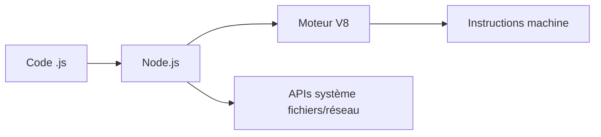

`Couche T — Tooling`

# Node.js & npm

> Comprendre le runtime qui permet d'exécuter JavaScript en dehors du navigateur.

**Prérequis :** aucun

**Ce que tu vas apprendre :**
- Ce qu'est Node.js et pourquoi il existe
- Comment vérifier ton installation et utiliser le REPL
- Comment créer un serveur HTTP minimal

---

## 🟦 Carte d'identité

**Définition simple :**
> Imagine que ton navigateur parle JavaScript. Longtemps, JavaScript ne pouvait 
> vivre QUE dans un navigateur. Node.js, c'est la décision de sortir JavaScript 
> du navigateur pour le faire tourner directement sur ton ordinateur — comme 
> Python ou Java. C'est ça et rien d'autre.

**Rôle technique :**
> Node.js est un "runtime" : un programme qui lit du code JavaScript et 
> l'exécute sur ton OS, sans navigateur. Il permet de créer des serveurs web, 
> des scripts, des outils en ligne de commande. npm (Node Package Manager) est 
> livré avec — c'est le magasin de briques réutilisables.

**Schéma** :
📸 à ajouter dans docs/

**Ce que Node.js n'est PAS :**
- Ce n'est pas un langage (le langage c'est JavaScript)
- Ce n'est pas un framework (React, Next.js sont des frameworks qui tournent 
  grâce à Node.js)
- Ce n'est pas un serveur web (c'est un outil pour EN créer un)

**Schéma mental :**
```
Navigateur Chrome  →  moteur V8  →  exécute JavaScript
Node.js            →  moteur V8  →  exécute JavaScript (sans navigateur)
→ même moteur, contexte différent
```

---

## 🟩 Sous le capot

**Mécanisme :**
> 1. Tu écris du code JavaScript dans un fichier `.js`
> 2. Tu lances `node fichier.js` dans le terminal
> 3. Node.js utilise le moteur V8 de Google pour transformer le code en instructions machine
> 4. V8 exécute le code et retourne le résultat
> 5. Node.js ajoute des APIs système (fichiers, réseau) que le navigateur n'a pas

**Outils d'observation :**
```bash
# Version de Node.js
node --version

# Version de npm
npm --version

# Où est installé Node sur ta machine
which node

# Lister les paquets installés globalement
npm list -g --depth=0
```

**Schéma technique** :


**Comprendre npm :**
> npm c'est comme l'App Store mais pour les briques de code.
> Quand tu fais "npm install express", tu télécharges une brique 
> que quelqu'un d'autre a écrite. Ces briques s'appellent des "paquets" 
> ou "dépendances". Elles sont listées dans package.json.

---

## 🟥 Laboratoire de test

**POC 1 — Node.js sans fichier (direct dans le terminal) :**
```bash
# Ouvre le REPL Node.js (Read Eval Print Loop)
node

# Dans le REPL, tape :
console.log("Bonjour depuis Node.js")
2 + 2
process.version
process.platform
.exit
```

**POC 2 — Premier script Node.js :**
Voir le fichier src/hello-node.js

**POC 3 — Créer un serveur HTTP minimal :**
Voir le fichier src/serveur-minimal.js
→ Ce POC fait le lien direct avec le module C1-01-ports et C1-02-HTTP

**Test de compréhension :**
> Question : quand tu lances "node src/serveur-minimal.js", 
> qui démarre en premier — Node.js ou ton navigateur ?
> Réponse : Node.js démarre le serveur, PUIS tu ouvres le navigateur. 
> Le navigateur est le client, Node.js est le serveur.

**Commande clé à retenir :**
```bash
node --version && npm --version
```

---

## 💀 Zone de hack

**Vulnérabilité classique — dépendances non vérifiées :**
> npm install fait confiance à n'importe quel paquet. Des paquets malveillants 
> ont déjà été publiés sur npm (ex: event-stream en 2018, ua-parser-js en 2021).

**Vérification de base :**
```bash
# Auditer les vulnérabilités de tes dépendances
npm audit

# Voir combien de paquets installe une seule dépendance
npm install express --dry-run
```

**Contre-mesure :**
> - Toujours vérifier le nombre de téléchargements et la date de mise à jour 
>   d'un paquet avant de l'installer
> - Utiliser "npm audit" régulièrement
> - Ne jamais installer un paquet dont tu ne comprends pas l'utilité

---

## 🔄 Alternatives

| Outil | Gratuit | Open Source | Freemium | Premium | Limites |
|-------|---------|-------------|----------|---------|---------|
| Node.js | ✅ | ✅ | — | — | Mono-thread par défaut |
| Deno | ✅ | ✅ | — | — | Écosystème plus petit |
| Bun | ✅ | ✅ | — | — | Jeune, compatibilité partielle |

> **Recommandation EticLab :** Node.js est le standard. C'est ce qu'utilisent Next.js, Vercel, et 95% de l'écosystème.

---

## ✅ Checklist de validation

- [ ] Est-ce que je sais expliquer ce qu'est Node.js vs JavaScript ?
- [ ] Est-ce que je sais vérifier ma version de Node.js et npm ?
- [ ] Est-ce que je sais lancer un script avec `node fichier.js` ?
- [ ] Est-ce que je sais ce que fait `npm audit` ?

---

## 🧰 Toolbox

| Outil | Usage | Prix | Risque |
|-------|-------|------|--------|
| Node.js | Runtime JavaScript | Gratuit, open source | Version obsolète = failles |
| npm | Gestionnaire de paquets | Gratuit | Dépendances malveillantes |
| nvm | Gérer plusieurs versions Node | Gratuit | Confusion de versions |
| npx | Exécuter un paquet sans l'installer | Inclus avec npm | Exécution de code distant |

---

## 📚 Aller plus loin

- [Node.js — documentation officielle](https://nodejs.org/docs/latest/api/)
- [npmjs.com — registre des paquets](https://www.npmjs.com)

## Liens avec d'autres modules
- → C1-01-ports : Node.js écoute sur des ports
- → C1-02-HTTP : Node.js crée des serveurs HTTP
- → C2-01-OS : Node.js tourne sur ton OS
- → T-01b-package-json : package.json configure un projet Node.js
