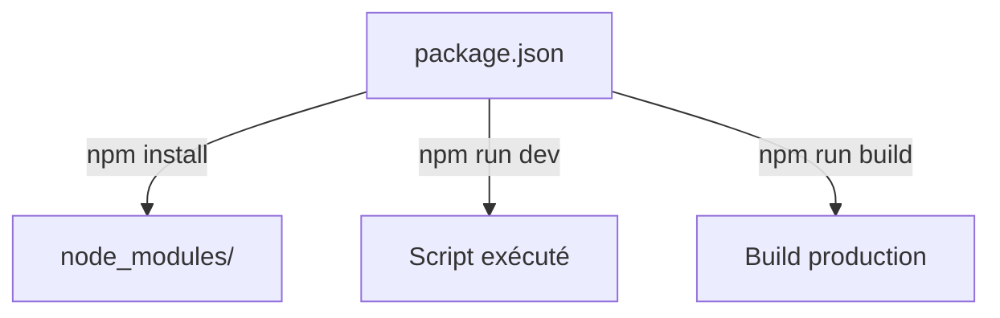

`Couche T — Tooling`

# package.json & scripts npm

> Comprendre le fichier de configuration central d'un projet Node.js et automatiser ses commandes.

**Prérequis :** `T-01` `T-02`

**Ce que tu vas apprendre :**
- L'anatomie d'un package.json et le rôle de chaque champ
- Comment fonctionnent les versions sémantiques (semver)
- Comment créer et lancer des scripts npm custom

---

## 🟦 Carte d'identité

**Définition simple :**
> package.json c'est la fiche d'identité de ton projet. 
> Il dit : "Ce projet s'appelle X, il a besoin des briques Y et Z, 
> et voici les commandes pour le lancer." Sans ce fichier, npm 
> ne sait rien de ton projet — il ne peut rien installer, 
> rien lancer, rien publier.

**Rôle technique :**
> package.json est un fichier JSON à la racine de chaque projet 
> Node.js. Il contient :
> - Le nom et la version du projet
> - La liste des dépendances (les briques téléchargées via npm)
> - Les scripts (les commandes automatisées)
> - Les métadonnées (auteur, licence, description)

**Schéma** :
📸 à ajouter dans docs/

**Ce que package.json n'est PAS :**
- Ce n'est pas du code exécutable (c'est de la configuration)
- Ce n'est pas optionnel (sans lui, `npm install` ne fait rien)
- Ce n'est pas le même fichier que package-lock.json (le lock 
  fige les versions exactes — on n'y touche jamais manuellement)

**Schéma mental :**
```
package.json  →  "Quoi installer et comment lancer"
     ↓
npm install   →  Télécharge tout dans node_modules/
     ↓
npm run dev   →  Lance le script "dev" défini dans package.json
```

---

## 🟩 Sous le capot

**Mécanisme :**
> 1. Tu crées un package.json avec `npm init`
> 2. Tu ajoutes des dépendances avec `npm install paquet`
> 3. npm télécharge le paquet dans node_modules/ et l'ajoute à package.json
> 4. Tu définis des scripts dans la section "scripts"
> 5. Tu lances tes scripts avec `npm run nom-du-script`

**Anatomie d'un package.json :**
```json
{
  "name": "mon-projet",
  "version": "1.0.0",
  "description": "Mon premier projet Node.js",
  "main": "index.js",
  "scripts": {
    "dev": "node src/serveur.js",
    "start": "node src/serveur.js",
    "build": "echo 'Pas de build pour l'instant'",
    "test": "echo 'Pas de tests pour l'instant'"
  },
  "dependencies": {
    "express": "^4.18.2"
  },
  "devDependencies": {
    "nodemon": "^3.0.0"
  }
}
```

**Outils d'observation :**
```bash
# Voir le package.json du projet
cat package.json

# Voir les scripts disponibles
npm run              # Liste tous les scripts

# Voir les dépendances installées
npm list --depth=0   # Niveau racine

# Voir si des dépendances sont obsolètes
npm outdated
```

**Schéma technique** :


**Comprendre les versions (semver) :**
```
"express": "^4.18.2"
              │ │  │
              │ │  └── patch (corrections de bugs)
              │ └──── minor (nouvelles fonctionnalités)
              └────── major (changements cassants)

^  = accepte minor + patch (^4.18.2 → 4.x.x)
~  = accepte patch uniquement (~4.18.2 → 4.18.x)
   = version exacte (4.18.2 → 4.18.2 uniquement)
```

---

## 🟥 Laboratoire de test

**POC 1 — Créer un package.json de zéro :**
```bash
mkdir ~/test-npm && cd ~/test-npm
npm init -y
```

**POC 2 — Installer et comprendre les dépendances :**
```bash
npm install chalk
npm install --save-dev nodemon
cat package.json
```

**POC 3 — Créer et lancer un script custom :**
> Ajouter dans package.json :
```json
"scripts": {
  "hello": "echo 'Bonjour depuis un script npm !'",
  "ports": "lsof -i -P -n | grep LISTEN"
}
```
```bash
npm run hello
npm run ports
```

**Test de panne :**
> Supprime node_modules/ et relance ton projet :
```bash
rm -rf node_modules
npm run dev
# → Erreur : les dépendances ne sont plus là
npm install
# → Tout est retéléchargé grâce à package.json
```

**Commande clé à retenir :**
```bash
npm run
```

---

## 💀 Zone de hack

**Vulnérabilité classique — scripts npm malveillants :**
> Un paquet npm peut définir des scripts qui s'exécutent 
> automatiquement à l'installation (preinstall, postinstall). 
> Un paquet malveillant peut exécuter du code sur ta machine 
> juste avec `npm install`.

**Vérification :**
```bash
npm info nom-du-paquet scripts
npm audit
npm install --ignore-scripts
```

**Contre-mesure :**
> - Vérifier le nombre de téléchargements hebdomadaires sur npmjs.com
> - Lire le package.json d'un paquet avant de l'installer
> - Ne jamais installer un paquet trouvé au hasard sur internet
> - Utiliser `npm audit` après chaque `npm install`

---

## 🔄 Alternatives

| Outil | Gratuit | Open Source | Freemium | Premium | Limites |
|-------|---------|-------------|----------|---------|---------|
| npm | ✅ | ✅ | — | — | Lent sur gros projets |
| pnpm | ✅ | ✅ | — | — | Liens symboliques, moins connu |
| yarn | ✅ | ✅ | — | — | Fragmentation v1 vs v2+ |
| bun | ✅ | ✅ | — | — | Jeune, compatibilité partielle |

> **Recommandation EticLab :** rester sur npm pour apprendre 
> (c'est le standard). Passer à pnpm quand on maîtrise les bases.

---

## ✅ Checklist de validation

- [ ] Est-ce que je sais créer un package.json avec npm init ?
- [ ] Est-ce que je sais la différence entre dependencies et devDependencies ?
- [ ] Est-ce que je sais lire une version semver (^4.18.2) ?
- [ ] Est-ce que je sais pourquoi on ne commite jamais node_modules/ ?

---

## 🧰 Toolbox

| Outil | Usage | Prix | Risque |
|-------|-------|------|--------|
| npm | Gestionnaire de paquets par défaut | Gratuit, inclus avec Node.js | Scripts malveillants |
| package.json | Fichier de configuration projet | Gratuit (fichier) | Mauvaises versions |
| npm audit | Scanner les vulnérabilités | Gratuit | Faux positifs |
| npx | Exécuter sans installer | Inclus avec npm | Exécution de code distant |
| nodemon | Redémarrage auto en dev | Gratuit, open source | Dev uniquement |

---

## 📚 Aller plus loin

- [npm — documentation officielle](https://docs.npmjs.com)
- [semver.org — comprendre les versions](https://semver.org)

## Liens avec d'autres modules
- → T-01-nodejs : npm est livré avec Node.js
- → T-02-terminal : on lance les scripts npm dans le terminal
- → T-03-git : .gitignore doit exclure node_modules/
- → C3-01-nextjs : Next.js utilise package.json pour ses scripts
