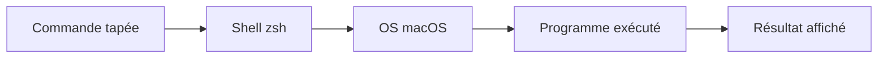

`Couche T — Tooling`

# Terminal & commandes

> Maîtriser l'interface texte de ton ordinateur — la base de tout développement.

**Prérequis :** aucun

**Ce que tu vas apprendre :**
- Les commandes essentielles (navigation, fichiers, processus)
- Comment enchaîner des commandes avec le pipe |
- Pourquoi ne jamais copier-coller une commande sans la comprendre

---

## 🟦 Carte d'identité

**Définition simple :**
> Le terminal c'est l'interface texte de ton ordinateur. 
> Avant les interfaces graphiques (icônes, souris), TOUT 
> se faisait comme ça. C'est plus direct, plus puissant, 
> et indispensable pour développer.

**Rôle technique :**
> Le terminal envoie des commandes directement à l'OS. 
> Chaque commande est un petit programme. Tu peux les 
> enchaîner, les combiner, les automatiser.

**Schéma** :
📸 à ajouter dans docs/

---

## 🟩 Sous le capot

**Mécanisme :**
> 1. Tu tapes une commande dans le terminal (ex: `ls -la`)
> 2. Le shell (zsh sur macOS) interprète la commande
> 3. Le shell cherche le programme correspondant sur le système
> 4. L'OS exécute le programme et retourne le résultat
> 5. Le terminal affiche la sortie

**Commandes essentielles :**
```bash
# Navigation
pwd          # Où suis-je ?
ls -la       # Lister les fichiers (avec cachés)
cd dossier   # Aller dans un dossier
cd ..        # Remonter d'un niveau
cd ~         # Aller à la racine utilisateur

# Fichiers
cat fichier  # Lire un fichier
touch fichier # Créer un fichier vide
mkdir nom    # Créer un dossier
rm fichier   # Supprimer un fichier (SANS corbeille)
cp src dest  # Copier
mv src dest  # Déplacer / renommer

# Processus
ps aux       # Lister tous les processus actifs
kill PID     # Tuer un processus par son ID
lsof -i :3000  # Quel programme utilise le port 3000 ?
lsof -ti:3000 | xargs kill  # Tuer ce qui est sur le port 3000

# Réseau
ping google.com   # Tester la connexion
curl url          # Faire une requête HTTP
ifconfig          # Voir les interfaces réseau et IP

# Utilitaires
which node   # Où est installé node ?
echo "texte" # Afficher du texte
history      # Historique des commandes
clear        # Vider le terminal
```

**Schéma technique** :


**Pourquoi "lsof -ti:3000 | xargs kill" n'a pas marché sur Benny :**
> Benny tourne probablement avec Next.js qui crée plusieurs 
> processus enfants. lsof trouve le processus principal, 
> mais les enfants restent vivants et relancent le parent.
> Solution : `pkill -f "next"` tue spécifiquement Next.js.

---

## 🟥 Laboratoire de test

**POC 1 — Explorer ta machine :**
```bash
pwd
ls -la ~/Dev/keticwork/eticlab
cat ~/Dev/keticwork/eticlab/README.md
```

**POC 2 — Comprendre les processus :**
```bash
# Voir tous les processus node actifs
ps aux | grep node

# Voir ce qui tourne sur tous les ports
lsof -i -P -n | grep LISTEN
```

**POC 3 — Enchaîner des commandes (pipe) :**
```bash
# Le | envoie la sortie d'une commande vers la suivante
ls -la | grep README
ps aux | grep node | grep -v grep
```

**Commande clé à retenir :**
```bash
lsof -i -P -n | grep LISTEN
```

---

## 💀 Zone de hack

**Vulnérabilité classique — rm sans réfléchir :**
> rm -rf supprime définitivement, sans corbeille.
> rm -rf / détruirait tout le système.
> Toujours vérifier ce qu'on supprime avant.

**Commande dangereuse à ne JAMAIS copier-coller sans comprendre :**
```bash
# NE PAS EXECUTER — exemple de commande destructrice
# rm -rf ~   ← supprime tout ton dossier utilisateur
```

**Contre-mesure :**
> - Lire chaque commande avant de l'exécuter
> - Ne jamais copier-coller une commande trouvée sur 
>   internet sans comprendre chaque mot
> - Créer un alias safe : alias rm='rm -i' dans ~/.zshrc

---

## 🔄 Alternatives

| Outil | Gratuit | Open Source | Freemium | Premium | Limites |
|-------|---------|-------------|----------|---------|---------|
| Terminal (macOS) | ✅ | — | — | — | Fonctionnalités basiques |
| iTerm2 | ✅ | ✅ | — | — | macOS uniquement |
| Warp | ✅ | — | ✅ | ✅ | Compte requis |
| Alacritty | ✅ | ✅ | — | — | Config complexe |

> **Recommandation EticLab :** Terminal natif macOS pour commencer. iTerm2 quand tu veux plus de confort (split panes, recherche).

---

## ✅ Checklist de validation

- [ ] Est-ce que je sais naviguer dans les dossiers avec cd/ls/pwd ?
- [ ] Est-ce que je sais utiliser le pipe | pour enchaîner des commandes ?
- [ ] Est-ce que je sais tuer un processus par PID ou par nom ?
- [ ] Est-ce que je comprends pourquoi rm -rf est dangereux ?

---

## 🧰 Toolbox

| Outil | Usage | Prix | Risque |
|-------|-------|------|--------|
| Terminal (macOS) | Terminal natif | Gratuit | rm -rf |
| iTerm2 | Terminal avancé Mac | Gratuit | Aucun |
| zsh | Shell par défaut macOS | Gratuit | Config complexe |
| oh-my-zsh | Thèmes et plugins zsh | Gratuit | Ralentit le terminal |

---

## 📚 Aller plus loin

- [explainshell.com — comprendre une commande](https://explainshell.com)
- [tldr pages — man simplifié](https://tldr.sh)

## Liens avec d'autres modules
- → T-01-nodejs : on lance node depuis le terminal
- → C1-01-ports : on inspecte les ports avec lsof
- → T-03-git : on utilise git depuis le terminal
- → C2-01-os : le terminal communique directement avec l'OS
