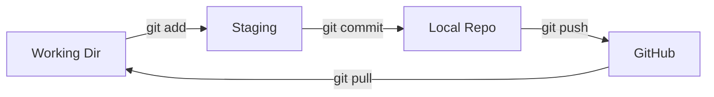

`Couche T — Tooling`

# Git & GitHub

> Comprendre le versioning de code : commits, branches, et collaboration via GitHub.

**Prérequis :** `T-02`

**Ce que tu vas apprendre :**
- Les 3 zones de Git (working directory, staging, repository)
- Les commandes Git du quotidien
- Pourquoi ne jamais commiter de secrets

---

## 🟦 Carte d'identité

**Définition simple :**
> Git c'est une machine à remonter le temps pour ton code. 
> Chaque "commit" est une photo de ton projet à un instant T. 
> Tu peux revenir en arrière, créer des branches parallèles, 
> fusionner des versions. GitHub c'est juste le cloud où tu 
> stockes ces photos.

**Rôle technique :**
> Git est un système de contrôle de version distribué. Il trace 
> chaque modification de chaque fichier, permet de travailler 
> en parallèle sur des branches, et de fusionner les changements.

**Schéma** :
📸 à ajouter dans docs/

**Git ≠ GitHub :**
> Git = l'outil local installé sur ta machine
> GitHub = le service en ligne (comme Dropbox mais pour Git)
> On pourrait utiliser Git sans GitHub (GitLab, Gitea, local)

---

## 🟩 Sous le capot

**Mécanisme :**
> 1. Tu modifies des fichiers dans ton projet
> 2. `git add` prépare les changements (staging area)
> 3. `git commit` crée une photo permanente avec un message
> 4. `git push` envoie la photo sur GitHub
> 5. Chaque commit a un hash unique (ex: a030150)

**Les 3 zones de Git :**
```
Working directory  →  Staging area  →  Repository
(tes fichiers)         (git add)        (git commit)
```

**Commandes du quotidien :**
```bash
git status           # Quels fichiers ont changé ?
git add fichier      # Préparer un fichier pour commit
git add .            # Préparer TOUS les changements
git commit -m "msg"  # Sauvegarder avec un message
git push             # Envoyer vers GitHub
git pull             # Récupérer depuis GitHub
git log --oneline    # Historique des commits
git diff             # Voir les changements non commités
```

**Schéma technique** :


**Commandes utiles :**
```bash
git branch           # Lister les branches
git checkout -b nom  # Créer et switcher sur une branche
git merge branche    # Fusionner une branche
git clone url        # Copier un repo existant
git remote -v        # Voir les remotes configurés
```

---

## 🟥 Laboratoire de test

**POC — Voir l'historique d'EticLab :**
```bash
cd ~/Dev/keticwork/eticlab
git log --oneline
git log --oneline --graph
git show HEAD        # Voir le dernier commit en détail
```

**Test de compréhension :**
> Combien de commits a EticLab ?
> Quel était le premier message de commit ?

**Commande clé à retenir :**
```bash
git log --oneline
```

---

## 💀 Zone de hack

**Vulnérabilité classique — secrets dans Git :**
> Le danger numéro 1 : commiter accidentellement 
> une clé API ou un mot de passe. Une fois pushé 
> sur GitHub (même repo privé), il faut considérer 
> la clé comme compromise.

**Vérification :**
```bash
# Chercher des secrets dans l'historique Git
git log --all --full-history -- "*.env"
git grep "API_KEY"
```

**Contre-mesure :**
> - Toujours avoir un .gitignore avec .env dedans
> - Utiliser .env.example pour montrer la structure 
>   sans les vraies valeurs
> - Outil : git-secrets pour bloquer les commits dangereux

---

## 🔄 Alternatives

| Outil | Gratuit | Open Source | Freemium | Premium | Limites |
|-------|---------|-------------|----------|---------|---------|
| GitHub | ✅ | — | ✅ | ✅ | Repos privés limités en gratuit |
| GitLab | ✅ | ✅ | ✅ | ✅ | Plus complexe |
| Gitea | ✅ | ✅ | — | — | Self-hosted uniquement |
| Bitbucket | ✅ | — | ✅ | ✅ | Moins populaire |

> **Recommandation EticLab :** GitHub — c'est le standard, intégré à Vercel, et gratuit pour les repos privés.

---

## ✅ Checklist de validation

- [ ] Est-ce que je sais les 3 zones de Git (working, staging, repo) ?
- [ ] Est-ce que je sais faire add → commit → push ?
- [ ] Est-ce que je sais pourquoi .env ne doit jamais être commité ?
- [ ] Est-ce que je sais lire l'historique avec git log ?

---

## 🧰 Toolbox

| Outil | Usage | Prix | Risque |
|-------|-------|------|--------|
| Git | Versioning local | Gratuit | Perte si mal utilisé |
| GitHub | Remote + collaboration | Gratuit / Pro | Secrets exposés |
| GitLens (VS Code) | Visualiser Git | Gratuit | Aucun |
| .gitignore.io | Générer .gitignore | Gratuit | Aucun |

---

## 📚 Aller plus loin

- [Git — documentation officielle](https://git-scm.com/doc)
- [Oh My Git! — jeu pour apprendre Git](https://ohmygit.org)

## Liens avec d'autres modules
- → T-02-terminal : git s'utilise en ligne de commande
- → C2-03-docker : .dockerignore fonctionne comme .gitignore
- → T-A01-claude : on versionne les prompts et configs Claude
