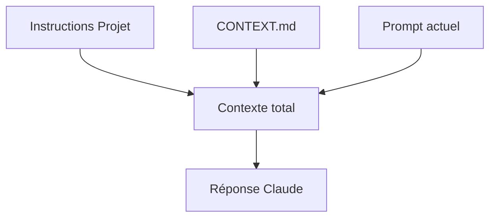

`Couche T — Tooling Avancé`

# Claude & IA

> Comprendre comment utiliser Claude et Claude Code efficacement pour un projet technique.

**Prérequis :** `T-02` `T-03`

**Ce que tu vas apprendre :**
- La différence entre Claude.ai et Claude Code
- Les 3 niveaux de contexte (Projet, CONTEXT.md, prompt)
- Comment structurer un bon prompt et éviter les hallucinations

---

## 🟦 Carte d'identité

**Définition simple :**
> Imagine un assistant ultra-compétent qui lit tes fichiers, 
> comprend ton code, écrit pour toi, et exécute des commandes. 
> Mais il a une mémoire courte : à chaque nouvelle conversation, 
> il repart de zéro. Ton travail c'est de lui donner le bon 
> contexte pour qu'il soit efficace immédiatement.

**Rôle technique :**
> Claude est un LLM (Large Language Model) d'Anthropic. 
> Il existe sous deux formes complémentaires :
> - **Claude.ai** — interface web pour réfléchir, architecturer, 
>   rédiger des prompts, organiser en Projets
> - **Claude Code** — CLI qui lit/écrit des fichiers, exécute 
>   des commandes, fait des commits Git directement dans ton terminal

**Schéma** :
📸 à ajouter dans docs/

**Ce que Claude n'est PAS :**
- Ce n'est pas un moteur de recherche (il peut halluciner des faits)
- Ce n'est pas un exécuteur aveugle (il comprend le contexte)
- Ce n'est pas infaillible (toujours vérifier le code généré)

**Schéma mental :**
```
Claude.ai (réflexion)     →  Projet + Instructions personnalisées
                               ↓
                          Prompt structuré
                               ↓
Claude Code (exécution)   →  Lit fichiers → Écrit code → Commit → Push
                               ↓
                          CONTEXT.md (pont entre sessions)
```

---

## 🟩 Sous le capot

**Mécanisme — Comment Claude traite ta demande :**
> 1. Tu envoies un prompt (texte + fichiers attachés)
> 2. Claude tokenise le texte (découpe en morceaux)
> 3. Le modèle génère une réponse token par token
> 4. Fenêtre de contexte = tout ce que Claude "voit" à cet instant
> 5. Quand la conversation dépasse la fenêtre, les anciens messages 
>    sont compressés ou perdus — d'où l'importance du CONTEXT.md

**Les 3 niveaux de contexte :**
```
Niveau 1 — Instructions du Projet (claude.ai)
  → Persistent entre toutes les conversations du projet
  → C'est ici qu'on met les règles permanentes

Niveau 2 — CONTEXT.md / CLAUDE.md (fichier dans le repo)
  → Lu par Claude Code au démarrage
  → Pont entre les sessions

Niveau 3 — Le prompt lui-même
  → Contexte éphémère de la conversation en cours
  → Disparaît à la fin de la session
```

**Outils d'observation :**
- Compteur de tokens dans Claude.ai (en bas de la conversation)
- `git log --oneline` pour voir ce que Claude Code a fait
- CONTEXT.md pour tracer l'état entre sessions

**Schéma technique** :


---

## 🟥 Laboratoire de test

**POC 1 — Structurer un Projet dans Claude.ai :**
> 1. Aller sur claude.ai → Projets → Créer un projet
> 2. Ajouter des Instructions personnalisées :
```
Tu es mon assistant technique pour le projet EticLab.
Dossier : ~/Dev/keticwork/eticlab
Repo : github.com/keticwork/eticlab
Toujours suivre le template dans _template/README.md.
Commiter avec des messages descriptifs en français.
```
> 3. Ajouter CONTEXT.md comme Knowledge du projet
> 4. Chaque nouvelle conversation hérite automatiquement de ce contexte

**POC 2 — Workflow Claude.ai → Claude Code :**
> 1. Dans Claude.ai : réfléchir à l'architecture d'un module
> 2. Demander à Claude.ai de rédiger le prompt pour Claude Code
> 3. Copier-coller le prompt dans Claude Code
> 4. Claude Code exécute, crée les fichiers, commit, push
> 5. Mettre à jour CONTEXT.md avec ce qui a été fait

**POC 3 — Tester les limites :**
> Demander à Claude quelque chose qu'il ne peut pas savoir :
> "Quel est le dernier commit sur mon repo ?"
> → Il ne peut pas le savoir sans lire le repo.
> → Dans Claude Code : il peut exécuter `git log` pour le savoir.
> → Dans Claude.ai : il faut lui fournir l'info.

**Test de panne :**
> Si tu ne donnes aucun contexte à Claude Code, il va :
> - Chercher un CLAUDE.md ou README.md à la racine
> - Deviner la structure du projet
> - Potentiellement faire des erreurs de structure
> → Le CONTEXT.md évite ce problème

**Commande clé à retenir :**
```bash
cat CONTEXT.md
```

---

## 💀 Zone de hack

**Vulnérabilité classique — hallucinations :**
> Claude peut inventer des fonctions, des API, des commandes 
> qui n'existent pas. Il le fait avec assurance, ce qui le 
> rend dangereux si tu ne vérifies pas.

**Exemples réels d'erreurs possibles :**
> - Inventer un flag CLI qui n'existe pas
> - Proposer une API deprecated sans le dire
> - Générer du code qui compile mais ne fait pas ce qu'on veut
> - Écrire un `writeHead` avant le routage (bug favicon vécu)

**Simulation — Piéger Claude :**
```
Prompt : "Quelle est la commande pour lister les ports 
ouverts sur macOS avec netstat -tulpn ?"

Réponse attendue : cette commande est pour Linux.
Sur macOS, utiliser lsof -i -P -n | grep LISTEN.

Si Claude répond sans corriger → hallucination.
```

**Contre-mesure :**
> - Toujours tester le code généré avant de le commiter
> - Vérifier les commandes sur `man` ou la doc officielle
> - Pour les API : vérifier la version et la date de la doc
> - Utiliser le CONTEXT.md pour éviter les erreurs de contexte
> - Relire les diffs (`git diff`) avant chaque commit

---

## 🔄 Alternatives

| Outil | Gratuit | Open Source | Freemium | Premium | Limites |
|-------|---------|-------------|----------|---------|---------|
| Claude.ai + Claude Code | — | — | ✅ | ✅ (Max) | Quota de tokens |
| ChatGPT + Codex | — | — | ✅ | ✅ | Moins bon en code structuré |
| GitHub Copilot | — | — | — | ✅ (10$/mois) | Autocomplétion uniquement |
| Cursor | — | — | ✅ | ✅ | IDE complet, courbe d'apprentissage |

> **Recommandation EticLab :** Claude.ai (Pro) + Claude Code — c'est le workflow validé. Claude.ai pour réfléchir, Claude Code pour exécuter.

---

## ✅ Checklist de validation

- [ ] Est-ce que je sais la différence entre Claude.ai et Claude Code ?
- [ ] Est-ce que je sais structurer un Projet avec des instructions ?
- [ ] Est-ce que je sais détecter une hallucination ?
- [ ] Est-ce que je mets à jour CONTEXT.md en fin de session ?

---

## 🧰 Toolbox

| Outil | Usage | Prix | Risque |
|-------|-------|------|--------|
| Claude.ai | Réflexion, architecture, prompts | Gratuit / Pro 20$/mois | Hallucinations |
| Claude Code | Exécution, fichiers, commits | Inclus Pro / Max | Modifications non voulues |
| Projets (claude.ai) | Contexte persistant | Inclus Pro | Limité en Knowledge |
| CONTEXT.md | Pont entre sessions | Gratuit (fichier) | Oublier de le mettre à jour |
| CLAUDE.md | Config auto pour Claude Code | Gratuit (fichier) | Trop de règles = confusion |

---

## 📚 Aller plus loin

- [Claude Code — documentation](https://docs.anthropic.com/en/docs/claude-code)
- [Prompt Engineering Guide](https://docs.anthropic.com/en/docs/build-with-claude/prompt-engineering)

## Bonnes pratiques découvertes

**Structure d'un bon prompt pour Claude Code :**
```
1. Contexte — Quel projet, quel dossier, quel état actuel
2. Action — Ce que tu veux qu'il fasse (précis)
3. Contraintes — Template à suivre, conventions de commit
4. Vérification — Comment valider que c'est correct
```

**Workflow validé pour EticLab :**
```
1. Claude.ai → Réfléchir au module, rédiger le contenu
2. Claude Code → Créer les fichiers, commit, push
3. CONTEXT.md → Mettre à jour en fin de session
4. Prochaine session → Claude Code lit CONTEXT.md et reprend
```

## Liens avec d'autres modules
- → T-02-terminal : Claude Code s'exécute dans le terminal
- → T-03-git : Claude Code fait les commits et push
- → Tous les modules : Claude aide à les rédiger et les tester
