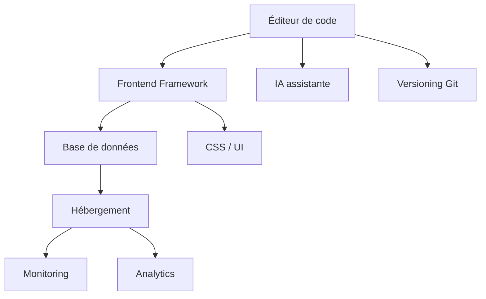

`Couche T — Tooling Avancé`

# Outils & alternatives

> Vue d'ensemble de tous les outils d'un projet SaaS moderne, avec leurs alternatives classées par modèle économique.

**Prérequis :** aucun (module de référence)

**Ce que tu vas apprendre :**
- Les catégories d'outils nécessaires pour un SaaS
- Comment choisir un outil selon son contexte (budget, taille, besoin)
- Les pièges du vendor lock-in et comment les éviter

---

## 🟦 Carte d'identité

**Définition simple :**
> Pour construire une maison, tu as besoin d'outils : marteau, 
> tournevis, perceuse. Pour construire un SaaS, c'est pareil — 
> mais les outils sont des logiciels. Ce module est ta boîte à 
> outils complète : pour chaque besoin (coder, héberger, stocker 
> les données...), tu as plusieurs options. À toi de choisir 
> la bonne selon ton budget et ton niveau.

**Rôle technique :**
> Ce module est une référence transversale. Il ne couvre pas un 
> concept technique mais cartographie tous les outils du stack 
> SaaS moderne et leurs alternatives. Chaque catégorie inclut 
> des options gratuites pour démarrer et des options pro pour scaler.

**Schéma** :
📸 à ajouter dans docs/

**Principes de choix :**
| Critère | Question à se poser |
|---------|---------------------|
| Gratuit vs payant | Est-ce que le plan gratuit suffit pour mon usage actuel ? |
| Open source | Est-ce que je peux self-host si le service ferme ? |
| Vendor lock-in | Est-ce que je peux migrer facilement vers une alternative ? |
| Communauté | Est-ce que je trouverai de l'aide si je suis bloqué ? |
| Durabilité | Est-ce que cet outil existera encore dans 3 ans ? |

---

## 🟩 Sous le capot

**Mécanisme — Comment choisir un outil :**
> 1. Identifie le besoin exact (héberger, stocker, coder, monitorer...)
> 2. Liste les options gratuites en premier
> 3. Vérifie les limites du plan gratuit (suffisent-elles ?)
> 4. Évalue le vendor lock-in (peux-tu migrer facilement ?)
> 5. Choisis l'outil avec la meilleure communauté / documentation

**Schéma technique** :


---

## 1. Éditeur de code

| Outil | Gratuit | Open Source | Freemium | Premium | Limites |
|-------|---------|-------------|----------|---------|---------|
| VS Code | ✅ | ✅ | — | — | Electron (lourd en RAM) |
| Cursor | ✅ | — | ✅ | ✅ (20$/mois) | Fork de VS Code, IA intégrée |
| Zed | ✅ | ✅ | — | — | Jeune, macOS/Linux uniquement |
| Windsurf | ✅ | — | ✅ | ✅ | Fork de VS Code, IA intégrée |
| Neovim | ✅ | ✅ | — | — | Courbe d'apprentissage extrême |
| WebStorm | — | — | — | ✅ (8$/mois) | JetBrains, puissant mais lourd |

> **Recommandation EticLab :** VS Code — gratuit, universel, 
> extensions infinies. Cursor si tu veux l'IA intégrée dans l'éditeur.

---

## 2. IA assistante

| Outil | Gratuit | Open Source | Freemium | Premium | Limites |
|-------|---------|-------------|----------|---------|---------|
| Claude.ai + Claude Code | ✅ | — | ✅ (Pro 20$) | ✅ (Max) | Quota de tokens |
| ChatGPT | ✅ | — | ✅ (Plus 20$) | ✅ (Pro) | Moins bon en code structuré |
| GitHub Copilot | — | — | — | ✅ (10$/mois) | Autocomplétion, pas d'agent |
| Cursor (IA intégrée) | ✅ | — | ✅ | ✅ (20$/mois) | Lié à l'éditeur Cursor |
| Gemini (Google) | ✅ | — | ✅ | ✅ | Moins mature pour le code |
| Codeium / Supermaven | ✅ | — | ✅ | — | Autocomplétion uniquement |

> **Recommandation EticLab :** Claude.ai (Pro) pour réfléchir + 
> Claude Code pour exécuter. C'est le workflow validé — voir T-A01.

---

## 3. Frontend framework

| Outil | Gratuit | Open Source | Freemium | Premium | Limites |
|-------|---------|-------------|----------|---------|---------|
| Next.js | ✅ | ✅ | — | — | Complexe pour débutant, opinions fortes |
| Remix | ✅ | ✅ | — | — | Moins de communauté |
| Astro | ✅ | ✅ | — | — | Moins adapté aux apps interactives |
| Nuxt (Vue) | ✅ | ✅ | — | — | Écosystème Vue, pas React |
| SvelteKit | ✅ | ✅ | — | — | Pas de React, écosystème plus petit |
| Vite + React | ✅ | ✅ | — | — | Pas de SSR natif, pas de routing |

> **Recommandation EticLab :** Next.js — c'est la stack (Reflety, 
> Benny, EticLab). SSR natif, routing par fichiers, optimisé Vercel.

---

## 4. Base de données

| Outil | Gratuit | Open Source | Freemium | Premium | Limites |
|-------|---------|-------------|----------|---------|---------|
| Supabase | ✅ | ✅ | ✅ | ✅ | 500 MB gratuit, 2 projets, pause 7j inactifs |
| Firebase (Google) | ✅ | — | ✅ | ✅ | NoSQL, vendor lock-in Google |
| Neon | ✅ | ✅ | ✅ | ✅ | PostgreSQL serverless, pas d'auth intégré |
| PlanetScale | — | — | ✅ | ✅ | MySQL (pas PostgreSQL), plan gratuit supprimé |
| MongoDB Atlas | ✅ | ✅ | ✅ | ✅ | NoSQL (documents), pas de SQL |
| Turso (libSQL) | ✅ | ✅ | ✅ | — | SQLite distribué, écosystème jeune |
| PostgreSQL local | ✅ | ✅ | — | — | Tu gères tout toi-même |

> **Recommandation EticLab :** Supabase — PostgreSQL standard, API 
> auto-générée, auth incluse, plan gratuit suffisant pour apprendre. 
> Intégration Vercel Marketplace. Voir C4-01.

---

## 5. Hébergement

| Outil | Gratuit | Open Source | Freemium | Premium | Limites |
|-------|---------|-------------|----------|---------|---------|
| Vercel | ✅ | — | ✅ | ✅ (Pro 20$/mois) | Optimisé Next.js, timeout 10s gratuit |
| Netlify | ✅ | — | ✅ | ✅ | Bon pour statique, moins optimisé Next.js |
| Railway | ✅ | — | ✅ | ✅ | Docker-based, 5$ de crédit gratuit |
| Render | ✅ | — | ✅ | ✅ | Spin-down en gratuit (lent au réveil) |
| Fly.io | ✅ | — | ✅ | ✅ | Edge computing, config complexe |
| Hetzner VPS | — | — | — | ✅ (3-5€/mois) | Contrôle total, maintenance manuelle |
| Coolify | ✅ | ✅ | — | — | Self-hosted Vercel alternative |

> **Recommandation EticLab :** Vercel Pro — intégration native Next.js, 
> déploiement automatique, CDN inclus. Voir C5-01. Pour un serveur 
> que tu contrôles : Hetzner VPS + Coolify.

---

## 6. Versioning (Git)

| Outil | Gratuit | Open Source | Freemium | Premium | Limites |
|-------|---------|-------------|----------|---------|---------|
| GitHub | ✅ | — | ✅ | ✅ | Standard, intégré Vercel |
| GitLab | ✅ | ✅ | ✅ | ✅ | CI/CD intégré, plus complexe |
| Gitea | ✅ | ✅ | — | — | Self-hosted uniquement |
| Bitbucket | ✅ | — | ✅ | ✅ | Atlassian, moins populaire |

> **Recommandation EticLab :** GitHub — standard, intégré à Vercel 
> et Supabase, gratuit pour les repos privés. Voir T-03.

---

## 7. CSS / UI

| Outil | Gratuit | Open Source | Freemium | Premium | Limites |
|-------|---------|-------------|----------|---------|---------|
| Tailwind CSS | ✅ | ✅ | — | — | Classes utilitaires, verbeux |
| shadcn/ui | ✅ | ✅ | — | — | Copie le code, maintenance manuelle |
| Radix UI | ✅ | ✅ | — | — | Primitives headless (sans style) |
| Material UI (MUI) | ✅ | ✅ | — | ✅ | Lourd, style Google imposé |
| Chakra UI | ✅ | ✅ | — | — | Moins maintenu récemment |
| CSS Modules | ✅ | ✅ | — | — | Natif Next.js, pas de librairie |

> **Recommandation EticLab :** Tailwind CSS + shadcn/ui — combo 
> recommandé par Vercel et la communauté Next.js. Voir C3-03.

---

## 8. Monitoring & erreurs

| Outil | Gratuit | Open Source | Freemium | Premium | Limites |
|-------|---------|-------------|----------|---------|---------|
| Sentry | ✅ | ✅ | ✅ | ✅ | Standard, 5K events gratuits/mois |
| LogRocket | — | — | ✅ | ✅ | Session replay, lourd |
| Datadog | — | — | — | ✅ | Entreprise, cher |
| BetterStack | ✅ | — | ✅ | ✅ | Logs + uptime, simple |
| Vercel Logs | ✅ | — | ✅ | — | Basique, pas de rétention longue |

> **Recommandation EticLab :** Sentry (plan gratuit) pour les 
> erreurs en production. Vercel Logs pour les Serverless Functions 
> en développement. Pas besoin de plus au début.

---

## 9. Analytics

| Outil | Gratuit | Open Source | Freemium | Premium | Limites |
|-------|---------|-------------|----------|---------|---------|
| Plausible | — | ✅ | — | ✅ (9$/mois) | Léger, RGPD-friendly, pas de cookies |
| PostHog | ✅ | ✅ | ✅ | ✅ | Product analytics, feature flags |
| Umami | ✅ | ✅ | ✅ | — | Self-hosted, simple, RGPD-friendly |
| Google Analytics | ✅ | — | — | ✅ | Lourd, cookies, problèmes RGPD |
| Vercel Analytics | ✅ | — | ✅ | — | Web Vitals, basique |

> **Recommandation EticLab :** Umami (self-hosted gratuit) ou 
> Plausible. Pas de Google Analytics — trop lourd et problématique 
> RGPD. PostHog si tu veux du product analytics avancé.

---

## 🟥 Laboratoire de test

**POC — Auditer ta stack actuelle :**
> Pour chaque outil que tu utilises, réponds à ces questions :
> 1. Est-ce que le plan gratuit me suffit ?
> 2. Est-ce que je peux migrer si le service ferme ?
> 3. Est-ce que j'ai une alternative en tête ?

**Commande clé à retenir :**
```bash
# Voir tous les outils installés globalement
npm list -g --depth=0
```

---

## 💀 Zone de hack

**Vulnérabilité classique — vendor lock-in :**
> Si tu construis tout autour d'un outil propriétaire (Firebase, 
> Vercel), migrer devient très coûteux. Un changement de prix 
> ou une fermeture de service peut te bloquer.

**Contre-mesure :**
> - Préférer les outils open source quand possible
> - Utiliser PostgreSQL (standard) plutôt qu'une BDD propriétaire
> - Garder le code framework-agnostic quand c'est raisonnable
> - Avoir un plan B documenté pour chaque outil critique

---

## 🔄 Alternatives

> Ce module EST la référence des alternatives. 
> Voir chaque section ci-dessus pour les tableaux comparatifs.

---

## ✅ Checklist de validation

- [ ] Est-ce que je connais au moins 2 alternatives pour chaque catégorie ?
- [ ] Est-ce que je sais identifier le vendor lock-in ?
- [ ] Est-ce que je sais choisir entre gratuit et premium selon mon contexte ?
- [ ] Est-ce que j'ai un plan B si un outil critique ferme ?

---

## 🧰 Toolbox

| Outil | Usage | Prix | Risque |
|-------|-------|------|--------|
| alternativeto.net | Trouver des alternatives | Gratuit | Aucun |
| stackshare.io | Comparer les stacks | Gratuit | Aucun |
| npmjs.com | Vérifier un paquet npm | Gratuit | Aucun |
| Product Hunt | Découvrir de nouveaux outils | Gratuit | Hype vs utilité |

---

## 📚 Aller plus loin

- [free-for.dev — liste d'outils gratuits pour devs](https://free-for.dev)
- [stackshare.io — comparer les stacks tech](https://stackshare.io)

## Liens avec d'autres modules
- → Tous les modules : chaque module a sa propre section Alternatives
- → C3-01-nextjs : choix du framework frontend
- → C4-01-supabase : choix de la base de données
- → C5-01-vercel : choix de l'hébergement
- → T-A01-claude : choix de l'IA assistante
