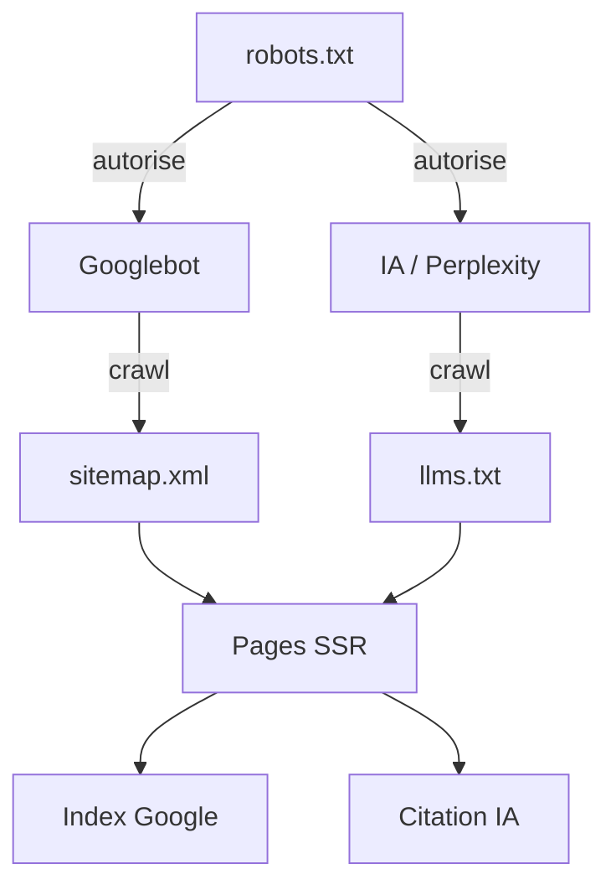

`Couche T — Tooling Avancé`

# SEO & LLM-friendly

> Comprendre comment rendre une plateforme Next.js visible sur Google et dans les IA (ChatGPT, Claude, Perplexity).

**Prérequis :** `C3-01` `C3-02` `C5-01`

**Ce que tu vas apprendre :**
- Comment Google indexe un site (crawl, index, rank)
- Comment les IA trouvent et citent ton contenu (llms.txt)
- Les optimisations SEO concrètes dans Next.js (meta, sitemap, SSR)

---

## 🟦 Carte d'identité

**Définition simple :**
> Imagine que tu écris un livre. Le SEO c'est mettre ton livre 
> dans la bonne étagère de la bibliothèque avec un bon titre 
> sur la couverture, pour que les gens le trouvent. Le LLM-friendly, 
> c'est écrire le livre de façon que les robots (IA comme ChatGPT 
> ou Perplexity) puissent le lire, le comprendre et le recommander.

**Rôle technique :**
> Le SEO (Search Engine Optimization) regroupe les techniques pour 
> apparaître dans les résultats de Google. Le LLM-friendly est 
> l'équivalent pour les IA : structurer son contenu pour qu'il 
> soit compris, cité et recommandé par les modèles de langage.
> Dans les deux cas, la clé est le contenu structuré et accessible.

**Schéma** :
📸 à ajouter dans docs/

**SEO vs LLM-friendly :**
| Aspect | SEO (Google) | LLM-friendly (IA) |
|--------|-------------|-------------------|
| Qui lit | Googlebot (crawler) | IA (ChatGPT, Claude, Perplexity) |
| Fichier d'instructions | robots.txt | llms.txt |
| Plan du site | sitemap.xml | sitemap.xml (partagé) |
| Ce qui compte | Balises meta, H1, liens, vitesse | Structure claire, contenu factuel, H1/H2 |
| Format | HTML rendu côté serveur (SSR) | Texte structuré, Markdown, HTML propre |
| Résultat | Lien dans les résultats Google | Citation dans une réponse IA |

---

## 🟩 Sous le capot

**Mécanisme — Comment Google indexe ton site :**
> 1. **Crawl** — Googlebot découvre tes pages via sitemap.xml ou liens
> 2. **Render** — Googlebot exécute le JavaScript (SSR est mieux)
> 3. **Index** — Google analyse le contenu et le stocke
> 4. **Rank** — Google classe ta page selon 200+ critères
> 5. **Affichage** — Ta page apparaît dans les résultats

**Mécanisme — Comment les IA trouvent ton contenu :**
> 1. L'IA a été entraînée sur des données web (avant une date de coupure)
> 2. Certaines IA (Perplexity, ChatGPT Browse) crawlent le web en temps réel
> 3. Elles cherchent du contenu structuré, factuel, avec des H1/H2 clairs
> 4. Le fichier `llms.txt` les guide vers le contenu important
> 5. Plus ton contenu est structuré et unique, plus il sera cité

**Les fichiers essentiels :**

### robots.txt
```txt
# public/robots.txt
User-agent: *
Allow: /

Sitemap: https://eticlab.vercel.app/sitemap.xml
```

### sitemap.xml (généré par Next.js)
```ts
// app/sitemap.ts
import { MetadataRoute } from 'next';

export default function sitemap(): MetadataRoute.Sitemap {
  const modules = [
    'c1-01-ports', 'c1-02-http', 'c1-03-cdn', 'c1-04-ssl',
    'c3-01-nextjs', 'c3-02-routing', 'c3-03-composants-ui',
    'c4-01-supabase', 'c4-02-api-rest', 'c5-01-vercel',
  ];

  const moduleUrls = modules.map((slug) => ({
    url: `https://eticlab.vercel.app/modules/${slug}`,
    lastModified: new Date(),
    changeFrequency: 'weekly' as const,
    priority: 0.8,
  }));

  return [
    {
      url: 'https://eticlab.vercel.app',
      lastModified: new Date(),
      changeFrequency: 'daily',
      priority: 1,
    },
    ...moduleUrls,
  ];
}
```

### llms.txt (pour les IA)
```txt
# public/llms.txt
# EticLab — Plateforme de formation technique

> EticLab est une plateforme de formation technique interactive
> qui couvre chaque brique d'un SaaS moderne, du hardware au business.

## Contenu principal
- Modules techniques : réseau, backend, frontend, déploiement
- Chaque module inclut : définition, mécanisme, POC, hack, alternatives
- Format structuré avec analogies simples et exemples concrets

## Pages principales
- /modules — liste de tous les modules
- /modules/[slug] — contenu détaillé d'un module

## Contact
- Site : https://eticlab.vercel.app
- GitHub : https://github.com/keticwork/eticlab
```

### Balises meta dans Next.js (App Router)
```ts
// app/layout.tsx
import type { Metadata } from 'next';

export const metadata: Metadata = {
  title: {
    default: 'EticLab — Formation technique interactive',
    template: '%s | EticLab',
  },
  description: 'Comprendre chaque brique d\'un SaaS moderne, du hardware au business.',
  openGraph: {
    title: 'EticLab',
    description: 'Formation technique interactive',
    url: 'https://eticlab.vercel.app',
    siteName: 'EticLab',
    locale: 'fr_FR',
    type: 'website',
  },
};
```

```ts
// app/modules/[slug]/page.tsx
import type { Metadata } from 'next';

export async function generateMetadata({ params }): Promise<Metadata> {
  return {
    title: `${params.slug} — Module EticLab`,
    description: `Comprendre ${params.slug} en profondeur : définition, mécanisme, POC et alternatives.`,
  };
}
```

**Outils d'observation :**
```bash
# Vérifier que le sitemap est accessible
curl https://eticlab.vercel.app/sitemap.xml

# Vérifier robots.txt
curl https://eticlab.vercel.app/robots.txt

# Vérifier llms.txt
curl https://eticlab.vercel.app/llms.txt

# Voir les balises meta d'une page
curl -s https://eticlab.vercel.app | grep -i "<meta"

# Tester si la page est SSR (contenu visible sans JS)
curl -s https://eticlab.vercel.app | grep "<h1"
```

**Schéma technique** :


**Checklist SEO pour chaque page :**
| Élément | Implémentation | Priorité |
|---------|---------------|----------|
| URL propre | `/modules/c1-04-ssl` (pas `/page?id=42`) | Critique |
| Titre `<title>` | Unique par page, < 60 caractères | Critique |
| Meta description | Unique, 120-160 caractères | Haute |
| H1 unique | Un seul H1 par page, descriptif | Critique |
| H2 structurés | Sous-sections logiques | Haute |
| SSR | Server-side rendering (défaut Next.js) | Critique |
| Open Graph | Titre + description + image pour les réseaux | Moyenne |
| Canonical URL | Éviter le contenu dupliqué | Moyenne |
| Alt text images | Description des images | Haute |
| Vitesse | Core Web Vitals (LCP, FID, CLS) | Haute |

---

## 🟥 Laboratoire de test

**POC 1 — Vérifier le rendu SSR :**
```bash
# Le contenu doit être visible dans le HTML brut (pas besoin de JS)
curl -s http://localhost:3000/modules/c1-01-ports | grep "<h1"
# Si tu vois le H1 → SSR fonctionne
# Si c'est vide → problème de rendu client-side
```

**POC 2 — Créer le sitemap :**
> Crée `app/sitemap.ts` avec le code de la section "Sous le capot".
```bash
# Vérifier
curl http://localhost:3000/sitemap.xml
```

**POC 3 — Tester avec Lighthouse :**
> 1. Ouvre ta page dans Chrome
> 2. F12 → onglet Lighthouse
> 3. Coche "SEO" et "Performance"
> 4. Lance l'audit
> 5. Score SEO devrait être > 90

**POC 4 — Créer llms.txt :**
> Crée `public/llms.txt` avec le contenu de la section "Sous le capot".
```bash
curl http://localhost:3000/llms.txt
```

**Test de panne :**
> Supprime la meta description d'une page :
> → Lighthouse perd des points SEO
> → Google affichera un extrait aléatoire de ta page

**Commande clé à retenir :**
```bash
curl -s https://ton-site.vercel.app | grep "<title\|<meta\|<h1"
```

---

## 💀 Zone de hack

**Vulnérabilité classique — cloaking (contenu différent pour Google) :**
> Montrer un contenu à Google et un autre aux visiteurs est 
> une technique de black hat SEO. Google pénalise lourdement 
> cette pratique — ton site peut être délisté.

**Autre risque — contenu dupliqué :**
> Si le même contenu est accessible via plusieurs URLs 
> (`/modules/ssl` et `/modules/SSL` et `/modules/ssl/`), 
> Google peut pénaliser pour contenu dupliqué.

**Contre-mesure :**
> - Toujours rediriger les variantes d'URL vers une URL canonique
> - Utiliser la balise `<link rel="canonical">` sur chaque page
> - URLs en minuscules uniquement, avec trailing slash consistant
> - Ne jamais générer de pages vides ou de thin content
> - Middleware Next.js pour forcer les redirections

```ts
// middleware.ts — forcer les URLs en minuscules
import { NextResponse } from 'next/server';
import type { NextRequest } from 'next/server';

export function middleware(request: NextRequest) {
  const url = request.nextUrl.clone();
  if (url.pathname !== url.pathname.toLowerCase()) {
    url.pathname = url.pathname.toLowerCase();
    return NextResponse.redirect(url);
  }
}
```

---

## 🔄 Alternatives

| Outil | Gratuit | Open Source | Freemium | Premium | Limites |
|-------|---------|-------------|----------|---------|---------|
| Next.js Metadata API | ✅ | ✅ | — | — | Natif, suffisant pour 90% des cas |
| next-seo (paquet npm) | ✅ | ✅ | — | — | Wrapper, moins nécessaire depuis App Router |
| Google Search Console | ✅ | — | — | — | Indispensable, données réelles Google |
| Ahrefs | — | — | — | ✅ (99$/mois) | Analyse backlinks, mots-clés, cher |
| Screaming Frog | ✅ | — | ✅ | ✅ | Crawler SEO, 500 URLs gratuites |
| Lighthouse | ✅ | ✅ | — | — | Audit SEO + performance intégré Chrome |

> **Recommandation EticLab :** Next.js Metadata API (natif) + 
> Google Search Console (gratuit, indispensable) + Lighthouse 
> (gratuit, intégré Chrome). Pas besoin d'outils payants au début. 
> Créer le `llms.txt` dès le premier déploiement.

---

## ✅ Checklist de validation

- [ ] Est-ce que chaque page a un `<title>` et une meta description uniques ?
- [ ] Est-ce que le sitemap.xml est accessible et à jour ?
- [ ] Est-ce que le llms.txt existe et décrit la plateforme ?
- [ ] Est-ce que le score Lighthouse SEO est > 90 ?

---

## 🧰 Toolbox

| Outil | Usage | Prix | Risque |
|-------|-------|------|--------|
| Google Search Console | Voir comment Google voit ton site | Gratuit | Aucun |
| Lighthouse | Auditer SEO + performance | Gratuit (Chrome) | Aucun |
| Rich Results Test | Tester les données structurées | Gratuit (Google) | Aucun |
| PageSpeed Insights | Tester la vitesse | Gratuit (Google) | Aucun |
| llms.txt | Guider les IA vers ton contenu | Gratuit (fichier) | Standard encore jeune |

---

## 📚 Aller plus loin

- [Next.js — Metadata API](https://nextjs.org/docs/app/building-your-application/optimizing/metadata)
- [Google — Search Central documentation](https://developers.google.com/search/docs)
- [llms.txt — spécification](https://llmstxt.org)

## Liens avec d'autres modules
- → C3-01-nextjs : SSR et Metadata API sont natifs Next.js
- → C3-02-routing : les URLs propres viennent du routing par fichiers
- → C5-01-vercel : Vercel optimise les Core Web Vitals
- → C1-02-http : les headers HTTP influencent le SEO (cache, redirections)
- → T-A01-claude : comprendre comment les IA consomment le contenu
