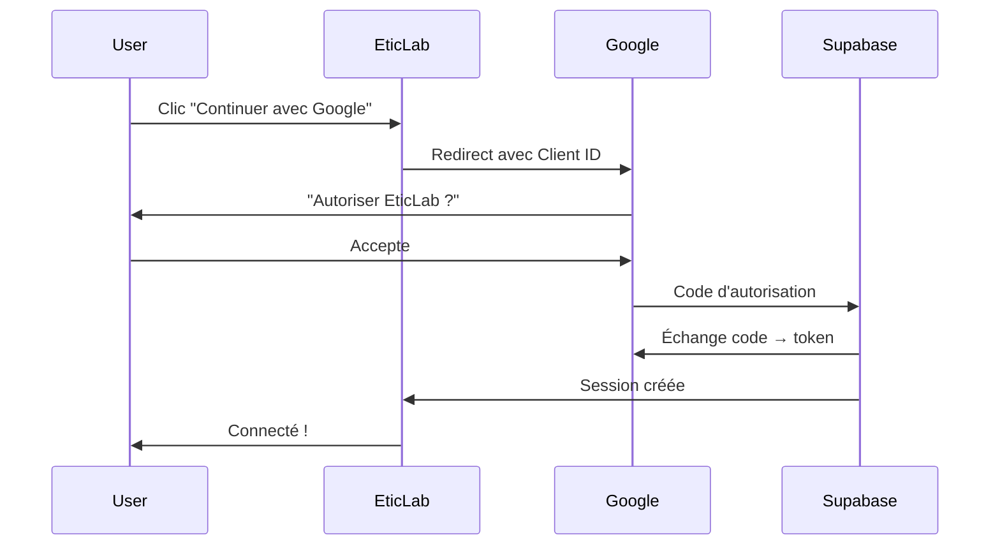

`Couche T — Tooling Avancé`

# Google Cloud & OAuth

> Comprendre Google Cloud Console, créer un projet, configurer OAuth 2.0, et connecter Google Auth à une app web.

**Prérequis :** `C3-01` `C4-01` `C1-04`

**Ce que tu vas apprendre :**
- Comment créer un projet Google Cloud et naviguer dans la Console
- Comment configurer OAuth 2.0 (Client ID, Client Secret, Redirect URI)
- La différence entre crédits gratuits et facturation réelle

---

## 🟦 Carte d'identité

**Définition simple :**
> Google Cloud Console, c'est le tableau de bord de Google pour 
> les développeurs. C'est là que tu crées les "clés" qui permettent 
> à ton application de dire "Bonjour Google, laisse cet utilisateur 
> se connecter avec son compte Google". OAuth 2.0 est le protocole 
> qui rend ça sécurisé — l'utilisateur ne te donne jamais son mot 
> de passe Google, il autorise juste ton app à lire son nom et email.

**Rôle technique :**
> Google Cloud Platform (GCP) est l'infrastructure cloud de Google. 
> Pour EticLab, on l'utilise uniquement pour OAuth 2.0 : permettre 
> aux utilisateurs de se connecter via leur compte Google. GCP fournit 
> le Client ID et le Client Secret que Supabase Auth utilise pour 
> vérifier l'identité de l'utilisateur.

**Schéma** :
📸 à ajouter dans docs/

**Ce qu'on utilise dans Google Cloud :**
| Service | Usage | Coût |
|---------|-------|------|
| OAuth 2.0 (APIs & Services) | Connexion Google | Gratuit |
| Console | Dashboard de gestion | Gratuit |
| Facturation | Paiement si services payants | 300$ de crédits gratuits |

**Ce qu'on n'utilise PAS (pour l'instant) :**
- Compute Engine (VMs) → on utilise Vercel
- Cloud Storage → on utilise Supabase Storage
- Cloud Functions → on utilise Vercel Serverless
- BigQuery, AI Platform, etc.

---

## 🟩 Sous le capot

**Mécanisme — Comment OAuth 2.0 fonctionne :**
> 1. L'utilisateur clique "Continuer avec Google" sur EticLab
> 2. EticLab redirige vers Google avec le Client ID
> 3. Google affiche "EticLab veut accéder à votre nom et email"
> 4. L'utilisateur accepte → Google génère un code d'autorisation
> 5. Google redirige vers EticLab avec ce code
> 6. Supabase échange le code contre un token d'accès
> 7. Supabase crée une session pour l'utilisateur

**Configurer OAuth dans Google Cloud :**
```
1. Aller sur console.cloud.google.com
2. Créer un projet (ex: "EticLab")
3. APIs & Services → OAuth consent screen
   - Type : Externe
   - Nom de l'app : EticLab
   - Email de contact : ton email
   - Domaines autorisés : eticlab-app.vercel.app
4. APIs & Services → Credentials → Create Credentials → OAuth client ID
   - Type : Web application
   - Nom : EticLab Web
   - Authorized redirect URIs :
     https://[REF].supabase.co/auth/v1/callback
5. Copier le Client ID et Client Secret
6. Dans Supabase : Authentication → Providers → Google
   - Coller Client ID et Client Secret
   - Activer le provider
```

**Les redirect URIs à configurer :**
| Environnement | Redirect URI |
|---------------|-------------|
| Supabase (obligatoire) | `https://[REF].supabase.co/auth/v1/callback` |
| Dev local (optionnel) | `http://localhost:3000/auth/callback` |
| Production | `https://eticlab-app.vercel.app/auth/callback` |

**Outils d'observation :**
```bash
# Vérifier que le provider Google est activé dans Supabase
# Dashboard → Authentication → Providers → Google → Enabled

# Tester le flow OAuth manuellement
# Ouvre /connexion → clique "Continuer avec Google"
# → Google consent screen → redirect → session créée
```

**Schéma technique** :


---

## 🟥 Laboratoire de test

**POC 1 — Créer un projet Google Cloud :**
> 1. Va sur console.cloud.google.com
> 2. Crée un nouveau projet "EticLab"
> 3. Explore le dashboard — repère les menus principaux

**POC 2 — Configurer OAuth :**
> Suis les étapes de la section "Sous le capot" pour créer 
> les credentials OAuth et les connecter à Supabase.

**POC 3 — Tester la connexion :**
> 1. Lance `npm run dev` dans eticlab-app
> 2. Va sur http://localhost:3000/connexion
> 3. Clique "Continuer avec Google"
> 4. Vérifie que la session est créée dans Supabase → Authentication → Users

**Test de panne :**
> Mets un mauvais Client Secret dans Supabase :
> → Google refuse l'échange de code
> → L'utilisateur voit une erreur après le consent screen
> → Remet le bon secret → tout refonctionne

**Commande clé à retenir :**
```
Redirect URI Supabase : https://[REF].supabase.co/auth/v1/callback
```

---

## 💀 Zone de hack

**Vulnérabilité classique — Client Secret exposé :**
> Le Client Secret Google ne doit JAMAIS être dans le code client 
> ou dans une variable `NEXT_PUBLIC_`. Il est stocké uniquement 
> dans Supabase (côté serveur).

**Autre risque — Redirect URI non restreint :**
> Si tu ne limites pas les redirect URIs dans Google Cloud, 
> un attaquant pourrait rediriger le flow OAuth vers son propre 
> site et voler le token.

**Contre-mesure :**
> - Lister UNIQUEMENT les URIs légitimes dans Google Cloud
> - Ne jamais utiliser `*` ou des patterns larges
> - Le Client Secret reste dans Supabase, jamais dans le code
> - Vérifier régulièrement les credentials dans la Console

---

## 🔄 Alternatives

| Outil | Gratuit | Open Source | Freemium | Premium | Limites |
|-------|---------|-------------|----------|---------|---------|
| Google OAuth (via GCP) | ✅ | — | — | — | Consent screen à configurer |
| GitHub OAuth | ✅ | — | — | — | Uniquement pour les devs |
| Apple Sign In | ✅ | — | — | ✅ (99$/an dev account) | Obligatoire sur iOS |
| Discord OAuth | ✅ | — | — | — | Public gamer/communauté |
| Auth0 | ✅ | — | ✅ | ✅ | 7500 users gratuits, puis payant |

> **Recommandation EticLab :** Google OAuth via Supabase Auth — 
> gratuit, universel (tout le monde a un compte Google), et Supabase 
> gère toute la complexité. Ajouter GitHub OAuth plus tard pour 
> les développeurs.

---

## ✅ Checklist de validation

- [ ] Est-ce que je sais créer un projet dans Google Cloud Console ?
- [ ] Est-ce que je sais configurer les credentials OAuth 2.0 ?
- [ ] Est-ce que je sais où mettre les redirect URIs ?
- [ ] Est-ce que je sais que le Client Secret ne va jamais côté client ?

---

## 🧰 Toolbox

| Outil | Usage | Prix | Risque |
|-------|-------|------|--------|
| Google Cloud Console | Gestion projet et credentials | Gratuit | Facturation si services payants |
| Supabase Auth | Intégration OAuth | Gratuit (plan free) | Aucun |
| OAuth Playground (Google) | Tester les scopes OAuth | Gratuit | Aucun |

---

## 📚 Aller plus loin

- [Google Cloud — OAuth 2.0 Setup](https://developers.google.com/identity/protocols/oauth2)
- [Supabase — Google OAuth Guide](https://supabase.com/docs/guides/auth/social-login/auth-google)

## Liens avec d'autres modules
- → C3-04-authentification : Google OAuth est un provider d'auth
- → C4-01-supabase : Supabase Auth gère le flow OAuth
- → C1-04-ssl : OAuth nécessite HTTPS (sauf localhost)
- → T-SEC01-securite : protection des secrets OAuth
