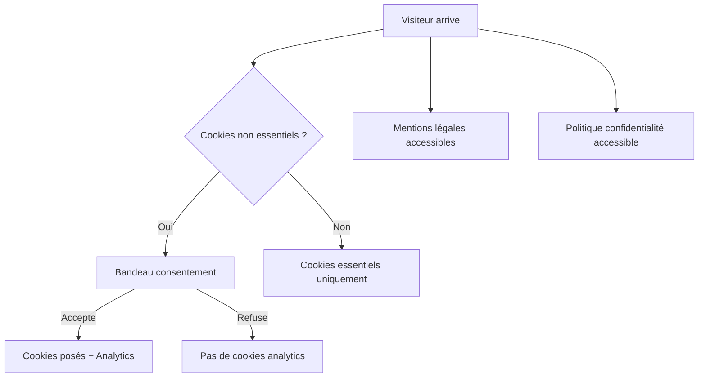

`Couche T — Tooling Avancé`

# Légal & RGPD

> Comprendre les obligations légales d'une plateforme web en France : mentions légales, confidentialité, cookies, CGU, CGV, et statut juridique.

**Prérequis :** `C5-01` `T-A03`

**Ce que tu vas apprendre :**
- Les 5 pages légales obligatoires pour un site web en France
- Comment fonctionne le RGPD et le consentement cookies
- Les différences entre autoentrepreneur et SASU pour un projet SaaS

---

## 🟦 Carte d'identité

**Définition simple :**
> Quand tu ouvres un magasin physique, tu dois afficher ton nom, 
> ton numéro SIRET, et respecter les lois sur la protection du 
> client. Sur le web, c'est pareil : tu dois dire qui tu es 
> (mentions légales), ce que tu fais des données des visiteurs 
> (RGPD), et quelles sont les règles du jeu (CGU/CGV). 
> Si tu ne le fais pas, tu risques des amendes.

**Rôle technique :**
> Le légal web couvre les obligations imposées par la loi française 
> et européenne à tout site web qui collecte des données ou vend 
> un service. Le RGPD (Règlement Général sur la Protection des 
> Données) est le texte européen qui encadre la collecte et le 
> traitement des données personnelles depuis 2018.

**Schéma** :
📸 à ajouter dans docs/

**Les 5 pages légales d'un site web :**
| Page | Obligatoire ? | Quand ? |
|------|---------------|---------|
| Mentions légales | ✅ Oui | Toujours, dès la mise en ligne |
| Politique de confidentialité | ✅ Oui | Dès qu'on collecte des données |
| Bandeau cookies / consentement | ✅ Oui | Dès qu'on utilise des cookies non essentiels |
| CGU (Conditions Générales d'Utilisation) | Recommandé | Dès qu'on a des utilisateurs inscrits |
| CGV (Conditions Générales de Vente) | ✅ Oui si vente | Dès qu'on vend un produit ou service |

---

## 🟩 Sous le capot

**Mécanisme — Ce que la loi exige :**
> 1. Identifier qui est derrière le site (mentions légales)
> 2. Informer les visiteurs de ce qu'on fait de leurs données (confidentialité)
> 3. Demander le consentement AVANT de poser des cookies non essentiels
> 4. Permettre aux utilisateurs de retirer leur consentement à tout moment
> 5. Pouvoir supprimer les données d'un utilisateur sur demande (droit à l'oubli)

---

### Page 1 — Mentions légales

**Contenu obligatoire (personne physique / autoentrepreneur) :**
```
- Nom et prénom du responsable
- Adresse du siège (domiciliation possible)
- Email de contact
- Numéro SIRET
- Hébergeur : Vercel Inc., 340 S Lemon Ave #4133, Walnut, CA 91789, USA
- Directeur de la publication : [Nom]
```

**Contenu obligatoire (SASU) :**
```
- Dénomination sociale : Etic
- Forme juridique : SASU
- Capital social : [montant]€
- Siège social : [adresse]
- RCS : [ville] B [numéro]
- Numéro SIRET : [numéro]
- Numéro TVA intracommunautaire : FR[XX][SIREN]
- Président : [Nom]
- Email : [email]
- Hébergeur : Vercel Inc.
```

---

### Page 2 — Politique de confidentialité

**Ce qu'elle doit contenir :**
```
1. Qui collecte les données (identité du responsable)
2. Quelles données sont collectées (email, nom, IP, cookies...)
3. Pourquoi (finalité : compte, analytics, newsletter...)
4. Base légale (consentement, contrat, intérêt légitime)
5. Durée de conservation (ex: 3 ans après dernier contact)
6. Qui a accès aux données (sous-traitants : Supabase, Vercel...)
7. Transferts hors UE (Supabase et Vercel sont aux USA)
8. Droits des utilisateurs (accès, rectification, suppression)
9. Comment exercer ses droits (email de contact)
10. Contact du DPO (si applicable) ou de la CNIL
```

**Sous-traitants à déclarer pour EticLab :**
| Service | Données | Localisation | Rôle |
|---------|---------|-------------|------|
| Vercel | Logs, IP, analytics | USA | Hébergement |
| Supabase | Email, données utilisateur | USA (AWS) | Base de données |
| Claude / OpenAI | Prompts utilisateur | USA | IA (si chat intégré) |
| Stripe | Données de paiement | USA | Paiement (si CGV) |

---

### Page 3 — Bandeau cookies / Consentement RGPD

**Les 3 catégories de cookies :**
| Catégorie | Consentement requis ? | Exemple |
|-----------|----------------------|---------|
| Essentiels | Non (toujours actifs) | Session, panier, langue |
| Analytics | Oui | Plausible, PostHog, GA |
| Marketing | Oui | Pubs, tracking, retargeting |

**Règles CNIL :**
> - Le bandeau doit apparaître AVANT que les cookies soient posés
> - L'utilisateur doit pouvoir refuser aussi facilement qu'accepter
> - "Continuer à naviguer" ≠ consentement (il faut un clic explicite)
> - Le consentement doit être renouvelé tous les 13 mois maximum
> - Les cookies essentiels n'ont pas besoin de consentement

**Implémentation Next.js :**
```tsx
// Composant simplifié — en prod, utiliser Axeptio ou Tarteaucitron
"use client";
import { useState, useEffect } from 'react';

export default function CookieBanner() {
  const [visible, setVisible] = useState(false);

  useEffect(() => {
    const consent = localStorage.getItem('cookie-consent');
    if (!consent) setVisible(true);
  }, []);

  const accept = () => {
    localStorage.setItem('cookie-consent', 'accepted');
    setVisible(false);
    // Activer analytics ici
  };

  const refuse = () => {
    localStorage.setItem('cookie-consent', 'refused');
    setVisible(false);
  };

  if (!visible) return null;

  return (
    <div style={{
      position: 'fixed', bottom: 0, left: 0, right: 0,
      background: '#1a1a2e', color: 'white', padding: '1rem',
      display: 'flex', justifyContent: 'space-between', alignItems: 'center'
    }}>
      <p>Ce site utilise des cookies pour améliorer votre expérience.</p>
      <div>
        <button onClick={refuse} style={{ marginRight: '0.5rem' }}>
          Refuser
        </button>
        <button onClick={accept}>Accepter</button>
      </div>
    </div>
  );
}
```

---

### Page 4 — CGU (Conditions Générales d'Utilisation)

**Structure type :**
```
1. Objet — description du service
2. Accès au service — inscription, conditions d'âge
3. Compte utilisateur — responsabilité, mot de passe
4. Contenu utilisateur — droits, modération
5. Propriété intellectuelle — qui possède quoi
6. Responsabilité — limitations
7. Données personnelles — renvoi vers politique de confidentialité
8. Modification des CGU — comment informer les utilisateurs
9. Droit applicable — tribunaux compétents (France)
10. Contact
```

---

### Page 5 — CGV (Conditions Générales de Vente)

**Obligatoire dès qu'il y a un paiement (compte payant EticLab) :**
```
1. Objet — ce qui est vendu (abonnement, accès premium)
2. Prix — TTC, devise, conditions de modification
3. Paiement — moyens acceptés (Stripe), sécurité
4. Droit de rétractation — 14 jours (contenu numérique : exception possible)
5. Durée et résiliation — abonnement mensuel/annuel, comment annuler
6. Responsabilité — limitations
7. Droit applicable — France
8. Contact — service client
```

---

### Autoentrepreneur vs SASU

| Critère | Autoentrepreneur | SASU |
|---------|-----------------|------|
| Création | Gratuit, en ligne | ~300€ (statuts, greffe) |
| Responsabilité | Illimitée (patrimoine perso) | Limitée au capital |
| Chiffre d'affaires max | 77 700€/an (services) | Illimité |
| TVA | Franchise en dessous du seuil | Obligatoire |
| Charges sociales | ~22% du CA | ~45% du salaire + IS |
| Crédibilité | Moins crédible pour investisseurs | Plus crédible |
| Embauche | Impossible | Possible |
| Cession | Impossible | Vente de parts possible |

> **Pour EticLab :** commencer en autoentrepreneur (simple, gratuit). 
> Passer en SASU quand le CA dépasse ~30K€/an ou si besoin 
> d'investisseurs/associés.

**Schéma technique** :


---

## 🟥 Laboratoire de test

**POC 1 — Vérifier les pages légales d'un site :**
```bash
# Vérifier qu'un site a ses pages légales
curl -s -o /dev/null -w "%{http_code}" https://ton-site.vercel.app/mentions-legales
curl -s -o /dev/null -w "%{http_code}" https://ton-site.vercel.app/confidentialite
curl -s -o /dev/null -w "%{http_code}" https://ton-site.vercel.app/cgu
# → 200 = page existe, 404 = page manquante
```

**POC 2 — Lister les cookies d'un site :**
> 1. Ouvre ton site dans Chrome
> 2. F12 → Application → Cookies
> 3. Liste tous les cookies posés AVANT consentement
> 4. S'il y a des cookies non essentiels → non conforme

**POC 3 — Vérifier la conformité avec la CNIL :**
> Le site de la CNIL propose un outil d'auto-évaluation :
> https://www.cnil.fr/fr/outil-pia-telechargez-et-installez-le-logiciel-pia

**Test de panne :**
> Supprime la page mentions légales :
> → Techniquement, le site fonctionne
> → Légalement, tu es en infraction (amende possible)

**Commande clé à retenir :**
```bash
# Vérifier que les pages légales existent et sont accessibles
for page in mentions-legales confidentialite cgu; do
  echo -n "$page: "
  curl -s -o /dev/null -w "%{http_code}\n" https://ton-site.vercel.app/$page
done
```

---

## 💀 Zone de hack

**Vulnérabilité classique — collecte sans consentement :**
> Poser Google Analytics sans bandeau cookies est illégal 
> en France. La CNIL a infligé des amendes de 150M€ à Google 
> et 60M€ à Facebook pour ce motif en 2022.

**Autre risque — données conservées trop longtemps :**
> Le RGPD impose de ne conserver les données que le temps 
> nécessaire. Un compte inactif depuis 3 ans doit être 
> supprimé (ou anonymisé).

**Vérification :**
```bash
# Vérifier si Google Analytics est chargé sans consentement
curl -s https://ton-site.vercel.app | grep "gtag\|analytics\|ga.js"
# Si résultat → vérifie que le bandeau cookies est en place
```

**Contre-mesure :**
> - Utiliser Plausible ou Umami (pas de cookies = pas de bandeau pour l'analytics)
> - Si cookies nécessaires → bandeau AVANT le chargement des scripts
> - Documenter la durée de conservation de chaque donnée
> - Mettre en place un processus de suppression sur demande
> - Ne jamais stocker de données de paiement (Stripe les gère)

---

## 🔄 Alternatives

| Outil | Gratuit | Open Source | Freemium | Premium | Limites |
|-------|---------|-------------|----------|---------|---------|
| Tarteaucitron | ✅ | ✅ | — | — | Standard français, config manuelle |
| Axeptio | — | — | ✅ | ✅ (à partir de 19€/mois) | Joli, conforme CNIL, français |
| Cookiebot | — | — | ✅ | ✅ | 100 pages gratuites, scan auto |
| Iubenda | — | — | ✅ | ✅ | Générateur de mentions légales + cookies |
| GDPR Cookie Consent (plugin) | ✅ | ✅ | — | — | WordPress uniquement |
| Consentement maison (code) | ✅ | — | — | — | Maintenance, risque non-conformité |

> **Recommandation EticLab :** Phase 1 : pas de cookies analytics 
> (utiliser Plausible/Umami sans cookies = pas de bandeau nécessaire). 
> Phase 2 : si cookies nécessaires, Tarteaucitron (gratuit, open source, 
> conforme CNIL). Pour les mentions légales et CGU, rédiger soi-même 
> avec un modèle puis faire valider par un juriste avant le lancement payant.

---

## ✅ Checklist de validation

- [ ] Est-ce que les mentions légales sont publiées et accessibles ?
- [ ] Est-ce que la politique de confidentialité liste tous les sous-traitants ?
- [ ] Est-ce que le consentement cookies est demandé AVANT de poser les cookies ?
- [ ] Est-ce que je sais la différence entre autoentrepreneur et SASU ?

---

## 🧰 Toolbox

| Outil | Usage | Prix | Risque |
|-------|-------|------|--------|
| CNIL.fr | Référence réglementaire française | Gratuit | Aucun |
| Tarteaucitron | Bandeau cookies open source | Gratuit | Config manuelle |
| Plausible / Umami | Analytics sans cookies | Gratuit / 9$/mois | Aucun |
| Stripe | Paiement conforme PCI DSS | Freemium | Aucun (ils gèrent la conformité) |
| PIA (CNIL) | Analyse d'impact sur les données | Gratuit | Complexe |

---

## 📚 Aller plus loin

- [CNIL — Guide RGPD pour les développeurs](https://www.cnil.fr/fr/guide-rgpd-du-developpeur)
- [CNIL — Cookies : les bons réflexes](https://www.cnil.fr/fr/cookies-et-autres-traceurs)
- [Service-Public.fr — Mentions légales](https://www.service-public.fr/professionnels-entreprises/vosdroits/F31228)

## Liens avec d'autres modules
- → C5-01-vercel : hébergeur à déclarer dans les mentions légales
- → C4-01-supabase : sous-traitant à déclarer (stockage données)
- → T-SEC01-securite : protection des données personnelles
- → T-A03-seo-llm : pages légales indexées pour le SEO
- → C3-02-routing : routes /mentions-legales, /confidentialite, /cgu
