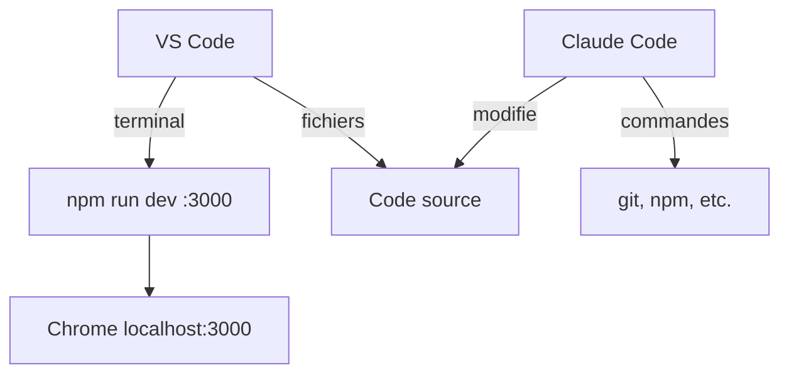

`Couche T — Tooling`

# Organisation du poste de travail

> Organiser son environnement de développement sur Mac : fenêtres, serveurs locaux, conflits de ports, et workflow efficace.

**Prérequis :** aucun

**Ce que tu vas apprendre :**
- Comment organiser tes fenêtres pour travailler efficacement
- Comment gérer plusieurs serveurs locaux sans conflits
- Les bugs classiques (cache Chrome, processus zombies) et comment les résoudre

---

## 🟦 Carte d'identité

**Définition simple :**
> Imagine un menuisier qui travaille sur un établi en bazar — 
> les outils partout, les vis mélangées, les plans sous une 
> planche. Il perd du temps à chercher au lieu de construire. 
> Ton poste de travail, c'est ton établi. Si tu l'organises 
> bien, tu passes ton temps à coder, pas à chercher quelle 
> fenêtre a ton terminal ou pourquoi le port 3000 est occupé.

**Rôle technique :**
> L'organisation du poste de travail couvre la gestion des 
> fenêtres (VS Code, terminal, navigateur), des serveurs 
> de développement (ports), et des processus en arrière-plan. 
> Un poste bien organisé évite les bugs liés à l'environnement 
> et fait gagner du temps sur chaque session.

**Schéma** :
📸 à ajouter dans docs/

---

## 🟩 Sous le capot

**Mécanisme — Le setup idéal pour coder :**
> 1. Ouvre VS Code sur le bon projet (`code ~/Dev/keticwork/eticlab-app`)
> 2. Ouvre le terminal intégré VS Code (Ctrl+`) ou iTerm2
> 3. Lance le serveur de dev (`npm run dev`)
> 4. Ouvre Chrome sur http://localhost:3000
> 5. Ouvre Claude Code dans un terminal séparé si besoin
> 6. Vérifie qu'aucun ancien serveur ne tourne sur le même port

**Organisation des fenêtres (Mac) :**
```
┌────────────────────┬────────────────────┐
│                    │                    │
│    VS Code         │    Chrome          │
│    (code)          │    (localhost)      │
│                    │                    │
│                    │                    │
├────────────────────┼────────────────────┤
│    Terminal         │    Claude Code     │
│    (npm run dev)   │    (si besoin)     │
│                    │                    │
└────────────────────┴────────────────────┘

Raccourcis Mac :
- Cmd+Tab     → changer d'application
- Ctrl+←/→    → changer de bureau virtuel
- Cmd+`       → changer de fenêtre dans la même app
- Ctrl+`      → terminal intégré VS Code
```

**Gestion des ports — le problème le plus fréquent :**
```bash
# Voir ce qui tourne sur quel port
lsof -i -P -n | grep LISTEN

# Ports classiques en dev :
# 3000 → Next.js (npm run dev)
# 3001 → Deuxième serveur / POC
# 5432 → PostgreSQL local
# 54321 → Supabase Studio local
```

**Règle simple : un projet = un port fixe**
| Projet | Port | Commande |
|--------|------|----------|
| EticLab App | 3000 | `npm run dev` |
| Benny | 3001 | `npm run dev -- -p 3001` |
| POC/tests | 3002 | `node serveur.js` (changer le port dans le code) |

**Outils d'observation :**
```bash
# Quels serveurs tournent ?
lsof -i -P -n | grep LISTEN

# Quel processus utilise le port 3000 ?
lsof -ti:3000

# Tuer un serveur sur un port
lsof -ti:3000 | xargs kill -9

# Tuer TOUS les processus Next.js
pkill -f "next dev"

# Tuer TOUS les processus Node.js (attention !)
pkill -f "node"
```

**Schéma technique** :


---

## 🟥 Laboratoire de test

**POC 1 — Vérifier les processus actifs :**
```bash
# Voir tout ce qui tourne
lsof -i -P -n | grep LISTEN

# Résultat attendu : rien (si aucun serveur n'est lancé)
# Ou : node sur :3000 si npm run dev tourne
```

**POC 2 — Simuler un conflit de ports :**
```bash
# Lance un serveur sur le port 3000
node -e "require('http').createServer().listen(3000, () => console.log('OK'))"

# Dans un autre terminal, lance npm run dev
cd ~/Dev/keticwork/eticlab-app && npm run dev
# → Next.js propose automatiquement le port 3001

# Libère le port
lsof -ti:3000 | xargs kill -9
```

**POC 3 — Tuer un serveur Next.js récalcitrant :**
```bash
# Le classique qui ne suffit pas toujours :
lsof -ti:3000 | xargs kill

# Le fix qui marche à tous les coups :
pkill -f "next dev"
# Ou en force :
lsof -ti:3000 | xargs kill -9
```

---

## 💀 Zone de hack

**Bug documenté 1 — Cache Chrome sur localhost :**
> Chrome cache agressivement les pages de localhost. Tu modifies 
> ton code, tu recharges la page, et tu vois l'ancienne version.
>
> **Symptôme :** "J'ai changé le code mais rien ne change dans le navigateur"
>
> **Solutions :**
```bash
# Hard refresh (force le rechargement sans cache)
# Mac : Cmd+Shift+R
# Ou : F12 → clic droit sur le bouton Refresh → "Empty Cache and Hard Reload"

# Désactiver le cache pendant le dev :
# F12 → Network → cocher "Disable cache" (actif quand DevTools est ouvert)
```

**Bug documenté 2 — Processus Next.js zombies :**
> Tu fermes ton terminal mais le serveur Next.js continue de 
> tourner en arrière-plan. Quand tu relances `npm run dev`, 
> le port 3000 est occupé.
>
> **Symptôme :** "Error: EADDRINUSE — port 3000 already in use"
>
> **Pourquoi :** Next.js crée un processus parent ET des processus 
> enfants. Fermer le terminal tue le parent, mais les enfants 
> survivent parfois.
>
> **Fix :**
```bash
# Voir qui occupe le port
lsof -i :3000

# Tuer par nom (le plus fiable)
pkill -f "next dev"

# Si ça ne suffit pas, kill -9
lsof -ti:3000 | xargs kill -9

# Vérifier que c'est libéré
lsof -i :3000
# → Aucun résultat = port libre
```

**Bug documenté 3 — VS Code qui ralentit :**
> VS Code surveille les fichiers pour le hot reload. Si tu ouvres 
> un dossier avec un node_modules de 200K fichiers, VS Code rame.
>
> **Fix :** Ajoute dans les settings VS Code :
```json
{
  "files.watcherExclude": {
    "**/node_modules/**": true,
    "**/.next/**": true
  }
}
```

**Contre-mesure :**
> - Toujours vérifier `lsof -i -P -n | grep LISTEN` en début de session
> - Prendre l'habitude de tuer les serveurs avant de fermer le terminal
> - Utiliser Ctrl+C dans le terminal (pas fermer le terminal directement)
> - Garder les DevTools ouvertes avec "Disable cache" coché

---

## 🔄 Alternatives

| Outil | Gratuit | Open Source | Freemium | Premium | Limites |
|-------|---------|-------------|----------|---------|---------|
| VS Code | ✅ | ✅ | — | — | Lourd en RAM avec beaucoup d'extensions |
| iTerm2 | ✅ | ✅ | — | — | macOS uniquement |
| Rectangle (window manager) | ✅ | ✅ | — | — | Raccourcis fenêtres Mac |
| Raycast | ✅ | — | ✅ | ✅ | Lanceur + snippets + window management |
| tmux | ✅ | ✅ | — | — | Terminal multiplexer, courbe d'apprentissage |

> **Recommandation EticLab :** VS Code + terminal intégré + Chrome. 
> Installer Rectangle (gratuit) pour organiser les fenêtres avec 
> des raccourcis clavier. Pas besoin de plus au début.

---

## ✅ Checklist de validation

- [ ] Est-ce que je sais vérifier quels serveurs tournent sur ma machine ?
- [ ] Est-ce que je sais tuer un processus sur un port spécifique ?
- [ ] Est-ce que je sais faire un hard refresh dans Chrome ?
- [ ] Est-ce que je sais organiser mes fenêtres pour coder efficacement ?

---

## 🧰 Toolbox

| Outil | Usage | Prix | Risque |
|-------|-------|------|--------|
| `lsof -i -P -n \| grep LISTEN` | Voir les ports occupés | Gratuit | Aucun |
| `pkill -f "next dev"` | Tuer les serveurs Next.js | Gratuit | Tue TOUS les Next.js |
| Cmd+Shift+R | Hard refresh Chrome | Gratuit | Aucun |
| Rectangle | Window manager Mac | Gratuit | Aucun |
| Activity Monitor | GUI processus Mac | Gratuit | Aucun |

---

## 📚 Aller plus loin

- [VS Code — Keyboard Shortcuts macOS](https://code.visualstudio.com/shortcuts/keyboard-shortcuts-macos.pdf)
- [Rectangle — window manager](https://rectangleapp.com)

## Liens avec d'autres modules
- → T-02-terminal : les commandes de gestion des processus
- → C1-01-ports : comprendre les ports et les conflits
- → C2-01-os : comprendre les processus de l'OS
- → T-A01-claude : organiser Claude dans son workflow
