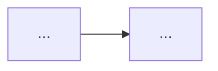

`Couche X — Nom de la couche`

# [Nom du module]

> Description courte en une ligne.

**Prérequis :** `T-01` `C1-01` `C1-02`

**Ce que tu vas apprendre :**
- ...
- ...
- ...

---

## 🟦 Carte d'identité

**Définition simple** (analogie pour un enfant de 5 ans) :
> ...

**Rôle technique** (à quoi ça sert dans un SaaS) :
> ...

**Schéma** :
📸 à ajouter dans docs/

---

## 🟩 Sous le capot

**Mécanisme** :
> 1. ...
> 2. ...
> 3. ...

**Outils d'observation** :
```bash
# ...
```

**Schéma technique** :


---

## 🟥 Laboratoire de test

**POC — Proof of Concept** :
<!-- Voir /src -->

**Test de panne** :
> Si je coupe X, que se passe-t-il ?

**Commande clé à retenir** :
```bash
# ...
```

---

## 💀 Zone de hack

**Vulnérabilité classique** :
> ...

**Simulation d'attaque** :
<!-- Voir /src/hack.* -->

**Contre-mesure** :
> ...

---

## 🔄 Alternatives

| Outil | Gratuit | Open Source | Freemium | Premium | Limites |
|-------|---------|-------------|----------|---------|---------|
| ... | ... | ... | ... | ... | ... |

> **Recommandation EticLab :** ...

---

## ✅ Checklist de validation

- [ ] Est-ce que je sais expliquer ce concept simplement ?
- [ ] Est-ce que je sais l'observer / le tester sur ma machine ?
- [ ] Est-ce que je connais la vulnérabilité principale ?
- [ ] Est-ce que je sais quelle alternative choisir et pourquoi ?

---

## 🧰 Toolbox

| Outil | Usage | Prix | Risque |
|-------|-------|------|--------|
| ... | ... | ... | ... |

---

## 📚 Aller plus loin

- [Documentation officielle](...)
- [Outil de test en ligne](...)
- [Article / tutoriel recommandé](...)
